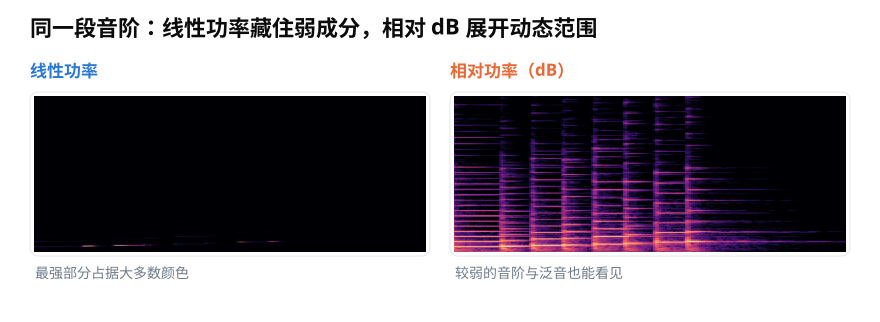
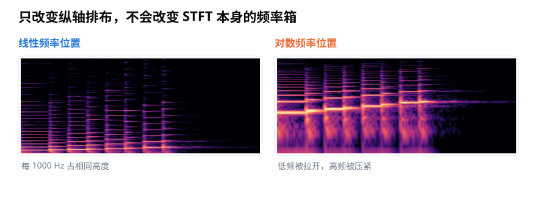
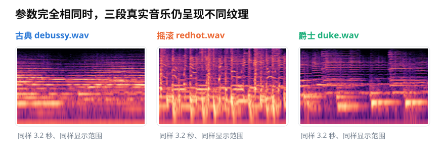

# 功率声谱图与相对分贝：怎样把 STFT 画得可信？

> **导读：** STFT 得到的是一张复数表，还不能直接当作声谱图。本文说明怎样从 STFT 计算功率、为什么常把最强位置设为 0 dB、对数频率轴究竟改了什么，以及比较多张图时必须固定哪些条件。

<picture>
  <source media="(max-width: 640px)" srcset="figures/mobile/00-course-position-16.svg">
  
</picture>

上一节已经把录音切成许多短片段，并为每个片段算出一列结果。接下来如果只执行一句“画成热力图”，同一段声音仍可能得到差别很大的图片：有的几乎全黑，有的细节很多，有的下半部分被拉得很开。

问题不一定出在 STFT，而可能出在后面的显示方法。要让图片有明确含义，需要说清每格颜色来自什么数字、最亮处代表什么，以及横纵坐标怎样排列。

<picture>
  <source media="(max-width: 640px)" srcset="figures/mobile/16-pipeline.svg">
  
</picture>

*图 1：STFT 只是中间结果。先算每格有多强，再选择比较基准并标明坐标，图中的位置和颜色才有完整含义。*

## 颜色先从“功率有多大”开始

STFT 中的每个格子是一个**复数**。它同时记录强度和起始位置；如果现在只想用颜色表示“这个时刻的这种振动有多强”，就先取它的模，再平方：

$$
P[k,t]=\left|X[k,t]\right|^2
$$

$X[k,t]$ 是第 $t$ 个时间片、第 $k$ 个频率位置的 STFT 结果，$P[k,t]$ 是对应的功率。功率越大，通常画得越亮。

但声音中的强弱差距可以非常大。在线性功率图里，少数最强位置会占据几乎全部颜色，较弱的谐波和余音因此不容易看见。

<picture>
  <source media="(max-width: 640px)" srcset="figures/mobile/16-linear-db.svg">
  
</picture>

*图 2：左图和右图来自同一份功率数据。相对 dB 没有创造新的声音成分，只是把很大的数值范围压缩到较容易观察的颜色范围。*

功率换成分贝时，常用下面的关系：

$$
D[k,t]=10\log_{10}\left(\frac{P[k,t]}{P_{\mathrm{ref}}}\right)
$$

$P_{\mathrm{ref}}$ 是比较基准。若把当前声谱图中的最大功率作为基准，最强位置就是 0 dB，其余位置通常是负数。`-20 dB` 表示功率是基准的百分之一，而不是“没有声音”。

这里的 dB 是**相对值**。一张图把自己的最强位置设为 0 dB，只适合观察图内结构；两段未经统一校准的录音都这样处理后，不能仅凭颜色判断哪段在现实中更响。

## 对数频率轴只改变摆放位置

普通线性频率轴给每 1000 Hz 相同的高度。这样会把大量画面留给高频，而音乐与语音中常见的低频基音和早期谐波挤在底部。

将纵轴改为对数频率，可以拉开低频、压紧高频。它让成倍的频率关系更容易看见，例如 200 到 400 Hz 与 1000 到 2000 Hz 都是频率翻倍。

<picture>
  <source media="(max-width: 640px)" srcset="figures/mobile/16-linear-log-frequency.svg">
  
</picture>

*图 3：两边使用同一份 STFT 数据和同一颜色范围。右图只是重新安排纵向位置，底层频率格没有变化。*

因此，`y_axis="log"` 不会自动把 STFT 变成梅尔频谱，也不会增加低频信息。它只是换了一把纵轴尺子。下一篇介绍的梅尔滤波器组则会真正合并频率格，两者不能混为一谈。

## 比较声谱图时，条件必须一致

横线常对应持续的谐波，竖向亮纹常对应短促敲击，弯曲或倾斜的轨迹说明频率正在变化。不同声音会留下不同纹理，但窗长、帧移、采样率、分贝参考值和颜色下限也会改变图片外观。

<picture>
  <source media="(max-width: 640px)" srcset="figures/mobile/16-genre-spectrograms.svg">
  
</picture>

*图 4：三段真实音乐截取相同长度，并用相同 STFT 参数、相对 dB 范围和配色显示。这样看到的纹理差别才主要来自声音本身。*

下面的代码把每一步明确写出：

```python
import librosa
import librosa.display
import matplotlib.pyplot as plt
import numpy as np

y, sr = librosa.load("audio.wav", sr=16000, mono=True)

X = librosa.stft(
    y,
    n_fft=1024,
    hop_length=256,
    window="hann",
    center=False,
)
power = np.abs(X) ** 2
power_db = librosa.power_to_db(power, ref=np.max, top_db=80)

librosa.display.specshow(
    power_db,
    sr=sr,
    hop_length=256,
    x_axis="time",
    y_axis="log",
)
plt.colorbar(label="相对当前图内最大功率的 dB")
plt.tight_layout()
plt.show()
```

`top_db=80` 把低于图内峰值 80 dB 的位置截到同一颜色下限，便于显示，也意味着这些更弱差异不再能从图上读出。若要比较多段录音，应固定处理参数和颜色范围；若要比较真实声压，还需要经过校准的录音链路，不能把普通音频文件中的相对 dB 当作声级计读数。

## 小结

可信的功率声谱图要回答三个问题：颜色来自什么数值，0 dB 相对谁，坐标轴怎样安排。功率由 STFT 的模平方得到；相对 dB 展开弱成分，却不代表绝对响度；对数频率轴改善观察方式，却不改变 STFT 数据。把这些选择写清楚，声谱图才既能看，也能比较和复现。

<!-- exercise:start -->

## 动手做：第 16 步 · 画出可比较的三张声谱图

课程项目《三首曲子，一个分类器》共 23 步，这是第 16 步。声谱图是给人看的。要能比较，颜色范围、频率轴、分贝参考必须三张一致。

1. 把 STFT 结果取模平方得到功率，再换算成相对分贝。
2. 为三种风格各画一张声谱图，**三张必须使用同一个 `vmin`/`vmax` 和同一个频率轴范围**。
3. 再故意画一组"每张各自归一化"的版本，放在一起对比。
4. 在笔记里写下：哪些差别在统一条件下才成立，哪些是各自归一化造成的假象。

**做完应该有**：两组各三张声谱图，以及一段关于比较条件的说明。

**自检**：统一条件下，摇滚那张的高频区域应该明显更亮。如果各自归一化后三张看起来差不多亮，正好说明了"归一化会抹掉绝对电平差别"。

上一步：[第 15 课 · 实现 STFT](../零基础版_11-15/15-短时傅里叶变换STFT-怎样同时看见频率与出现时间.md)　·　下一步：[第 17 课 · 造一组梅尔滤波器](17-梅尔刻度与三角滤波器组-为什么频率要按听感重新分带.md)　·　[项目全貌](../课程项目/README.md)

<!-- exercise:end -->
