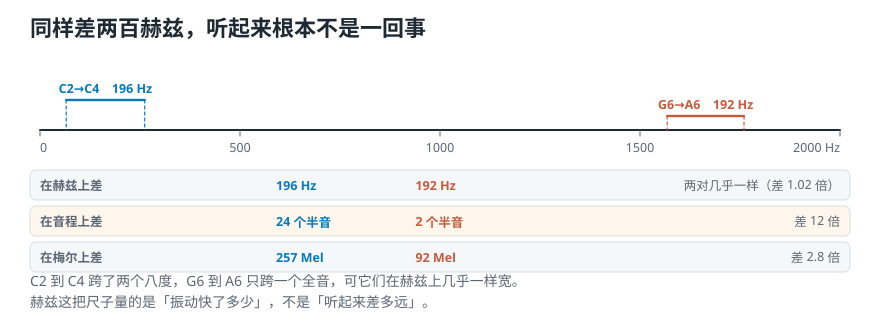
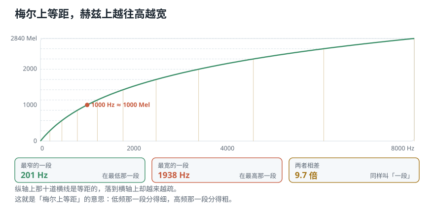
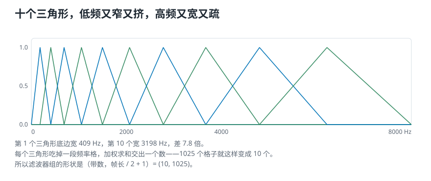
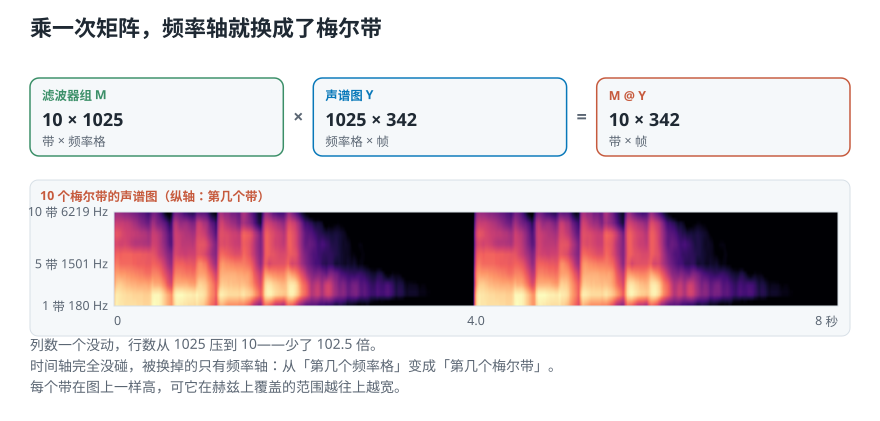

# 怎样按听感重新刻一把频率的尺子：梅尔刻度

> **导读：** 上一课把纵轴改成按倍数刻，理由是音乐里一个八度就是频率翻一倍。可人耳并不完全按倍数听。有个老实验能说明这件事：C2 升到 C4，和 G6 升到 A6，两次的**振动快慢**只差 196 和 192 —— 几乎一样；可前者听起来跨了两个八度，后者只跨一个全音。同样的差值，听感差 12 倍。这一课把频率轴换成一把**按听觉实验刻出来的尺子**，再用十个三角形把 1025 行压成 10 行。

<picture>
  <source media="(max-width: 640px)" srcset="figures/mobile/00-course-position-17.svg">
  
</picture>

完整代码在[第 17 课脚本](../课程代码/lessons/lesson17_mel_scale.py)，运行环境沿用[课程总纲](../课程总纲/README.md)里的一次性配置。

## 一个实验：同样差两百赫兹

拿两对音来听。下面每个音后面括号里那个数是它的**频率**，**也就是**一秒振动多少次，单位写作 Hz，读作赫兹。

- 第一对：C2（65.41 Hz）升到 C4（261.63 Hz）
- 第二对：G6（1567.98 Hz）升到 A6（1760.00 Hz）

```text
C2 -> C4  差 196.22 Hz
G6 -> A6  差 192.02 Hz
两者相差 1.02 倍，几乎一样
```

**可听起来完全不是一回事。** 用音乐里的**半音**去量——钢琴上相邻两个键就是一个半音——结果是：

```text
C2 -> C4  跨 24 个半音（两个八度）
G6 -> A6  跨  2 个半音（一个全音）
两者相差 12 倍
```

<picture>
  <source media="(max-width: 640px)" srcset="figures/mobile/17-same-hz-different-feel.svg">
  
</picture>

*图 1：横轴是赫兹。两个括号一样宽，只是位置不同。下面三行是同一对音在三把不同的尺子下量出来的结果。*

**赫兹这把尺子量的是「振动快了多少」，不是「听起来差多远」。** 低频那一段，人分得极细——几十赫兹的变化就是一个明显的音程；高频那一段，同样几十赫兹几乎听不出来。

上一课已经处理过这件事的一半：纵轴改成按倍数刻之后，一个八度不管在高音区还是低音区都占一样的高度。但那只是**音乐的结构**。人耳的实际反应比「按倍数」更复杂，尤其在很低的频率上。

## 一个合格的音频特征要凑齐三样

把前面几课的成果摆在一起看：

| 要求 | 哪一课解决的 |
|---|---|
| 能同时看见频率和时间 | 第 15 课的短时傅里叶变换 |
| 强弱按人的感觉来表示 | 第 16 课的分贝 |
| **频率按人的感觉来表示** | **还差这一样** |

前两样都有了：一张「频率 × 时间」的表格，格子里的强弱换成了分贝。**只剩频率轴还是原样。** 这一课补上最后一样，补完得到的东西叫**梅尔声谱图**。

## 梅尔刻度：一把按听感刻的尺子

「梅尔」这个名字来自 melody（旋律）。它是研究者做了大量听觉实验之后定出来的一把尺子，目标很直白：**在这把尺子上等距的两段，听起来的音高跨度也应该差不多。**

换算公式是一条经验公式：

$$
m = 2595 \cdot \log_{10}\left(1 + \frac{f}{700}\right)
$$

反过来换回赫兹：

$$
f = 700 \cdot \left(10^{m/2595} - 1\right)
$$

刻度的锚点定在 1000：

```text
1000 Hz -> 999.99 Mel
换回去   -> 1000.00 Hz
```

**2595 这个常数就是为了让这个点落在 1000 上凑出来的**，没有别的来历。

<picture>
  <source media="(max-width: 640px)" srcset="figures/mobile/17-mel-curve.svg">
  
</picture>

*图 2：横轴赫兹、纵轴梅尔。纵轴上那十道横线是等距的，落到横轴上却越来越疏。*

这条曲线的形状就是整件事的关键。把 0—8000 Hz 在**梅尔上**均分成十段，再切回赫兹看看每段有多宽：

```text
第  1 段     0 —   201 Hz，宽  201 Hz
第  5 段  1218 —  1768 Hz，宽  550 Hz
第 10 段  6062 —  8000 Hz，宽 1938 Hz
最窄 201 Hz，最宽 1938 Hz，差 9.7 倍
```

**梅尔上每段一样长，赫兹上却越往高越宽。** 这正是我们要的：低频那一段分得细，高频那一段分得粗。

## 用这把新尺子量一遍开头那两对音

这是对梅尔刻度的验收。同一对音，换成梅尔再量：

```text
C2 -> C4  赫兹差 196.22  梅尔差 257.20
G6 -> A6  赫兹差 192.02  梅尔差  91.59
两者相差 2.8 倍
```

**赫兹上两对几乎一样，梅尔上差了 2.8 倍。** 方向对了：听起来远的那一对，在梅尔上也远。

**但要说实话：2.8 倍并没有对上音程的 12 倍。** 梅尔刻度不是音乐的尺子，它是从「能不能听出差别」这类实验里拟合出来的，在 700 Hz 以下几乎是直线，只有到高频才弯成对数的样子。所以它和「一个八度」这种音乐概念本来就不会严丝合缝。

**那为什么不干脆直接取对数？** 因为对数在频率趋近 0 时会掉向负无穷，低频那一段根本没法用：

```text
 10 Hz -> 梅尔 15.99，log10 = 1.00
100 Hz -> 梅尔 150.49，log10 = 2.00
```

公式里那个 `+ 700` 就是干这个的：**它让低频那一段接近直线，高频那一段才弯下去。** 这也符合听感——几十赫兹上下的差别，人本来就分不太出来。

## 三步配方，前两步已经做完了

有了这把尺子，提取梅尔声谱图的做法就是三步：

1. **算短时傅里叶变换**，得到一张「频率格 × 帧」的表格 —— 第 15、16 课
2. **强弱换成分贝** —— 第 16 课
3. **频率轴换成梅尔刻度** —— 这一课

第三步不是简单地把每个频率格的标签改个数字，它要拆成三小步：

1. 选**要多少个梅尔带**
2. 造出**梅尔滤波器组**
3. 把滤波器组**乘到表格上**

## 第一小步：要多少个梅尔带

**没有标准答案，看任务。** 但可以把代价量出来。一帧 2048 个样本得到 1025 个频率格，取不同的带数：

| 梅尔带数 | 1025 行压成 | 压缩倍数 | 最低两带中心相距 | 最高两带中心相距 |
|---:|---:|---:|---:|---:|
| 10 | 10 | 102.5 | 226.6 Hz | 1416.6 Hz |
| 40 | 40 | 25.6 | 47.2 Hz | 487.7 Hz |
| 90 | 90 | 11.4 | 20.2 Hz | 231.1 Hz |
| 128 | 128 | 8.0 | 14.1 Hz | 165.0 Hz |

**带越多，保留的频率细节越多，交给模型的数也越多。** 常见的取值在 40 到 128 之间——和钢琴 88 个键差不多是同一个量级，大致够覆盖人听得清的那段音域。分辨乐器和分辨曲风需要的细致程度并不一样，所以这个数要按任务定。

下面用 10 个带来走完整个流程，因为十个三角形画出来看得清。

## 第二小步：按五步造出滤波器组

滤波器组在模仿耳蜗：**每一个「带」都只管一段频率，中间最敏感，两边逐渐不管。** 画出来就是一个三角形。造法有五步。

**① 把最低和最高频率换成梅尔**

```text
   0 Hz ->    0.00 Mel
8000 Hz -> 2840.02 Mel
```

**② 在梅尔上等距取「带数 + 2」个点**

要 10 个三角形，就取 12 个点。多出来的两个是因为**每个三角形要用到三个点**：左脚、顶、右脚，而相邻两个三角形共用点。

**③ 把这些点换回赫兹**

```text
0、180、407、692、1050、1501、
2067、2780、3676、4802、6219、8000
```

**在梅尔上它们是等距的，换回赫兹立刻变得越来越疏。**

**④ 四舍五入到最近的频率格**

```text
0、17、38、64、98、139、
192、258、341、446、578、743
```

**这一步不能省。** 手上的表格只有 1025 行，每行 10.77 Hz，中间没有东西——180 Hz 这个位置在表格里不存在，只能落到第 17 格（183 Hz）上。帧长定死了分辨率，比它更细的位置就是问不出来的。

**⑤ 每三个点造一个三角形**

从左脚爬到顶（权重 0 到 1），再从顶降到右脚（1 回到 0）。

<picture>
  <source media="(max-width: 640px)" srcset="figures/mobile/17-filter-bank.svg">
  
</picture>

*图 3：十个三角形，横轴是赫兹。左边又窄又挤，右边又宽又疏——这就是梅尔刻度的形状被画了出来。*

```text
第  1 个三角形底边宽  409 Hz
第 10 个三角形底边宽 3198 Hz
差 7.8 倍
滤波器组形状 (10, 1025)
```

形状里那个 1025 就是「帧长 / 2 + 1」，和表格的行数一致——**必须一致，否则乘不起来。**

（这里每个三角形的顶点都是 1。现成的库默认还会把三角形缩成等面积，那是下一课对齐时要处理的差别。）

## 第三小步：乘上去

现在两个矩阵都有了，一次矩阵乘法就完事：

```text
滤波器组 M   10 × 1025   （带 × 频率格）
声谱图   Y 1025 ×  342   （频率格 × 帧）
M @ Y       10 ×  342   （带 × 帧）
```

<picture>
  <source media="(max-width: 640px)" srcset="figures/mobile/17-apply.svg">
  
</picture>

*图 4：形状怎么对上，以及真的乘出来是什么样。纵轴不再是赫兹，而是「第几个带」。*

**乘法在做的事，说白了就是加权求和。** 结果的第 3 行第 5 列，等于「第 3 个三角形覆盖的那些频率格，在第 5 帧上的值，按三角形的高低加权后加起来」。

三件事值得看清楚：

- **行数从 1025 压到 10**，少了 102.5 倍。这是实打实的降维——同样一段音乐，交给模型的数少了两个数量级。
- **列数一个没动。** 时间轴完全没碰过，被换掉的只有频率轴。
- **每个带在图上一样高**，可它在赫兹上覆盖的范围越往上越宽。这正是「按听感刻」的意思。

## 这东西拿来干什么

梅尔声谱图是音频机器学习里用得最多的输入之一：音频分类、情绪识别、曲风分类、乐器分类，大多从它开始。原因就是上面那三件事——**它同时给了时间、给了感知上合理的强弱、给了感知上合理的频率，还顺手把数据量压下去了。**

## 这一课得到了什么，下一课接着讲什么

这一课只做了一件事：**把频率轴换掉。**

| 换之前 | 换之后 |
|---|---|
| 1025 个频率格，每格 10.77 Hz | 10 个梅尔带，宽度从 409 Hz 到 3198 Hz |
| 每格一样宽 | 低频窄、高频宽，按听感刻 |
| 表格 1025 × 342 | 表格 10 × 342 |

三个值得记住的数：C2→C4 和 G6→A6 在赫兹上只差 **1.02 倍**，在音程上差 **12 倍**；把 0—8000 Hz 在梅尔上均分十段，切回赫兹最宽的一段是最窄的 **9.7 倍**；十个三角形把 **1025 行压成 10 行**，列数一个没动。

这一课的滤波器组是照着那五步自己造的，所以每个数都能核对。[下一课](18-用Python提取梅尔声谱图-形状对上了数字却全不一样.md)把同样的事交给现成的库来做，然后**把两边的结果摆在一起对齐**——形状对不对得上、三角形要不要缩成等面积、带数改了以后哪些数跟着变。对不上的地方，才是真正要弄清楚的地方。
