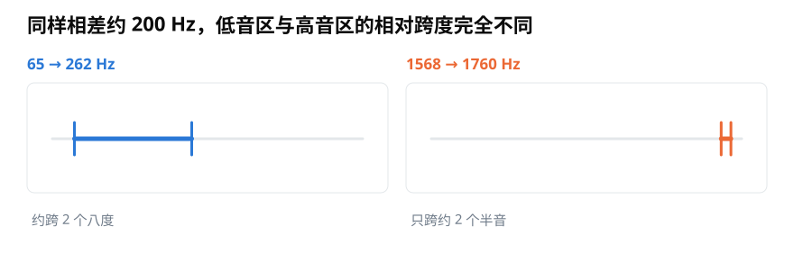
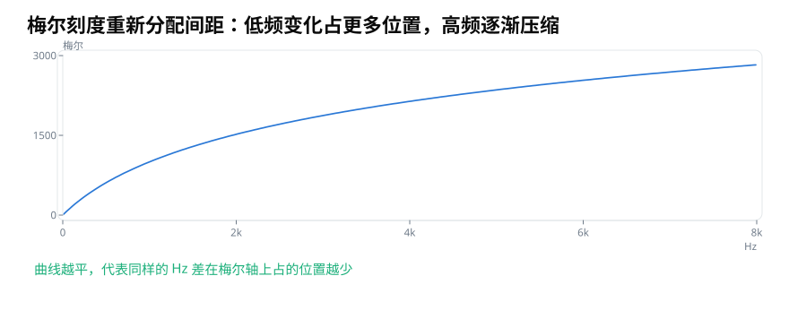
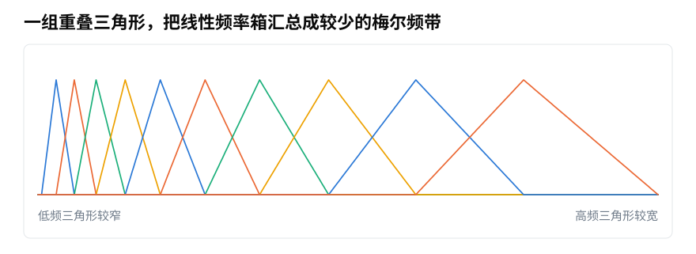

# 梅尔刻度与三角滤波器组：为什么频率要按听感重新分带？

> **导读：** 线性频谱把每 1 Hz 都当成相同距离，但人的听感并不是这样变化的。本文从两组相差约 200 Hz 的声音出发，解释梅尔刻度怎样重新安排频率距离，以及三角滤波器组怎样把 513 个线性频率格汇总成较少的梅尔频带。
>
> **读完能做到：** 解释频率为什么要按听感重新分带　·　构造一组梅尔三角滤波器　·　说出 513 行怎样变成 64 行

<picture>
  <source media="(max-width: 640px)" srcset="figures/mobile/00-course-position-17.svg">
  
</picture>

两组声音每秒重复次数都相差约 200 次。第一组从 65 次变成 262 次，后者已经是前者的四倍多；第二组从 1568 次变成 1760 次，只增加了大约十分之一。

<picture>
  <source media="(max-width: 640px)" srcset="figures/mobile/17-perception.svg">
  
</picture>

*图 1：每秒重复次数的差相近，听到的高低距离却不相近。起点较低的第一组发生了更大的相对变化。*

声音每秒振动多少次，这个数叫**频率**。

频率的单位叫**赫兹**，写作 Hz；人听到的调子高低则叫**音高**（[第 02 课](../零基础版_01-05/02-波形频率与音高-声音曲线记录了什么.md)讲过）。赫兹适合记录振动次数，却不一定适合平均分配声音表示中的位置。语音和许多日常声音的关键结构集中在低频，如果从 0 到 8000 Hz 全部等距排列，高频会占据大量格子，低频细节反而较拥挤。

## 梅尔刻度重新分配频率距离

**梅尔刻度**是一种根据听觉实验建立的频率标尺。它在低频处变化较快，到了高频逐渐压缩。一种常见的 HTK 写法是：

$$
m=2595\log_{10}\left(1+\frac{f}{700}\right)
$$

$f$ 是以 Hz 表示的频率，$m$ 是对应的梅尔值。代入 1000 Hz，结果约为 1000 mel。

<picture>
  <source media="(max-width: 640px)" srcset="figures/mobile/17-hz-mel.svg">
  
</picture>

*图 2：曲线越往右越平，表示同样的赫兹差在梅尔轴上占据的位置逐渐减少。梅尔是重新安排距离，不是发现了新的物理频率。*

梅尔刻度并不只有一种公式。常用软件还可能采用 Slaney 风格，低频段和高频段的安排与 HTK 略有不同。因此，文章或实验只写“使用梅尔频谱”还不够，最好同时记录具体约定。

## 一组重叠三角形负责汇总

有了新的刻度，还要把原来的线性频率格真正合并起来。常见做法是在梅尔轴上等距选出一组中心点，再换回赫兹位置，形成许多彼此重叠的三角形。

每个三角形都像一个柔和的收集器：中心附近的频率权重最大，离中心越远权重越小，三角形以外不计入。低频处的三角形较窄，高频处较宽。

<picture>
  <source media="(max-width: 640px)" srcset="figures/mobile/17-filterbank.svg">
  
</picture>

*图 3：相邻三角形相互重叠，避免把相近频率生硬切断。高频三角形覆盖更宽的赫兹范围，因此保留的局部细节较少。*

这一组收集器叫**梅尔滤波器组**。第 $m$ 个滤波器汇总一帧功率谱时，可以写成：

$$
E[m,t]=\sum_k H[m,k]P[k,t]
$$

$P[k,t]$ 是第 $t$ 帧、第 $k$ 个线性频率格的功率；$H[m,k]$ 是第 $m$ 个三角形在该位置给出的权重；$E[m,t]$ 是汇总后的梅尔频带功率。

例如三个频率格的功率是 4、9、1，权重是 0.2、1.0、0.3，这个频带得到的结果就是：

$$
0.2\times4+1.0\times9+0.3\times1=10.1
$$

## 从 513 行变成 64 行

如果把所有三角形的权重排成一张表，就得到滤波器矩阵 $H$。一段声音的功率声谱图记作 $P$，整段梅尔功率谱便是：

$$
S_{\mathrm{mel}}=HP
$$

假设 1024 点 FFT 产生 513 个非负频率格，使用 64 个梅尔频带时，$H$ 的尺寸是 $64\times513$。它乘以 $513\times T$ 的功率声谱图后，输出变成 $64\times T$；时间帧数 $T$ 没有改变。

<picture>
  <source media="(max-width: 640px)" srcset="figures/mobile/17-matrix-map.svg">
  
</picture>

*图 4：每个输出行都是若干线性频率格的加权和。梅尔变换不仅改变纵轴标签，还真正把频率信息汇总成较少的频带。*

频带数没有固定答案。数量少，表示更紧凑、轮廓更平滑；数量多，保留的纵向变化更多，但计算量和相邻频带之间的重复也会增加。选择时还要考虑采样率、关注的频率范围和具体任务。

梅尔频谱也不是所有声音任务的默认最佳选择。若任务要分开非常接近的高频纯音，或者分析人耳听不到的机器超声，按普通听感压缩频率未必合适。它的优势是把有限的表示能力放到许多语音与日常音频任务更关心的位置，而不是忠实保存每一个线性频率格。

## 小结

梅尔刻度解决的是“频率距离怎样分配”，三角滤波器组解决的是“原来的频率格怎样汇总”。两者合在一起，才得到梅尔频谱：低频保留较细的频带划分，高频逐渐合并，并把一张很高的功率声谱图压缩成较少的行。

<!-- exercise:start -->

## 动手做：第 17 步 · 造一组梅尔滤波器

课程项目《三首曲子，一个分类器》共 23 步，这是第 17 步。513 个频率位置太多，而且高频那一段人耳本来就分不细。这一步把它们按听感重新分组。

1. 在 `soundlab/mel.py` 里实现 `mel_filterbank(n_mels, n_fft, sr, fmin=0, fmax=None)`，返回形状为 `(n_mels, n_fft//2+1)` 的矩阵。
2. 把这个矩阵画出来：每一行是一个三角形，看它们怎样从密到疏地铺开。
3. 用 `librosa.filters.mel` 生成一份对照，比较两者的形状与总和。
4. 回答：为什么低频那几个三角形又窄又密，高频那几个又宽又疏？

**做完应该有**：`mel_filterbank` 函数，以及那张滤波器组图。

**自检**：相邻三角形应该互相重叠一半，整体从左到右越来越宽。如果所有三角形一样宽，说明你在赫兹上等分了，而不是在梅尔刻度上等分。

上一步：[第 16 课 · 画出可比较的三张声谱图](16-功率声谱图与相对分贝-怎样把STFT画得可信.md)　·　下一步：[第 18 课 · 提取对数梅尔频谱](18-用Python提取对数梅尔频谱-怎样固定参数与输出形状.md)　·　[项目全貌](../课程项目/README.md)

<!-- exercise:end -->
