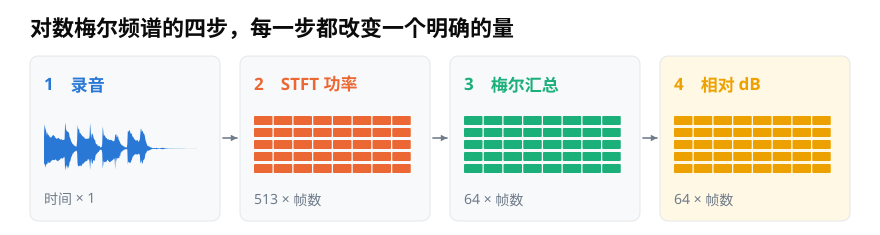
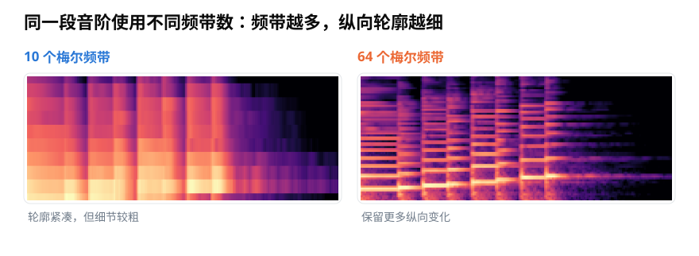
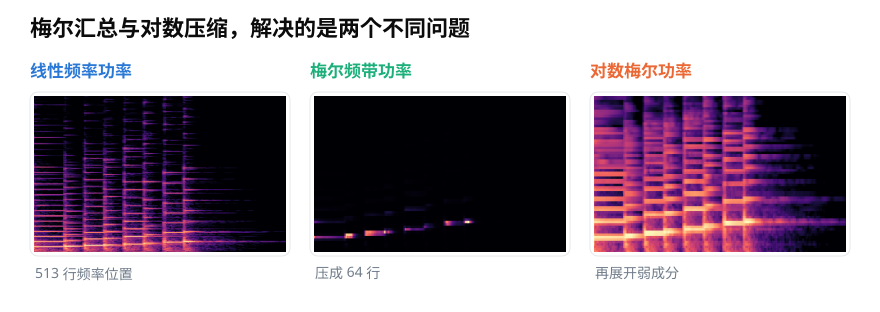

# 用 Python 提取对数梅尔频谱：怎样固定参数与输出形状？

> **导读：** `librosa.feature.melspectrogram()` 看起来只是一行代码，背后却包含分帧、功率计算和梅尔频带汇总。本文沿着数据形状走完这条处理链，并说明采样率、`n_fft`、帧移、频带数、频率范围和 dB 参考值分别控制什么。
>
> **读完能做到：** 写出参数完整、形状明确的实现　·　分清梅尔汇总与对数压缩解决的是两件事　·　记下足以复现同一张图的全部设置

<picture>
  <source media="(max-width: 640px)" srcset="figures/mobile/00-course-position-18.svg">
  
</picture>

许多声音识别程序接收的不是一长列录音数字，而是一张二维数字表。每一列对应一个短时间片段，每一行汇总一段从低到高的声音成分。

这种常见的数字表叫**对数梅尔频谱**。制作时先算出每个声音成分有多强，再把相邻成分汇总，最后把过大的强弱差距压到较容易处理的范围。

<picture>
  <source media="(max-width: 640px)" srcset="figures/mobile/18-pipeline.svg">
  
</picture>

*图 1：录音是一列随时间变化的数字；第二步得到 513 行；第三步汇总成 64 行；最后一步只改变数值尺度，不再改变形状。*

理解这四步之后，代码中的参数就不再是一串需要背诵的名字，而是每一步的具体选择。振动快慢叫**频率**；一段声音中各种频率的强弱分布，称为**频谱**。

把相邻位置按照听感汇总后得到的每一行，叫一个**梅尔频带**。

## `n_fft` 和 `n_mels` 控制不同的行数

当 `n_fft=1024` 时，实数声音的单边频谱有 513 个频率位置。这个行数来自 FFT，与梅尔频带数无关。

随后，`n_mels=64` 表示使用 64 个三角形收集器，把 513 行汇总成 64 行。这种按照权重收集相邻位置的工具叫**滤波器**。若改成 10 个频带，纵向轮廓会明显变粗；改成 64 个频带，会留下更多局部变化。

<picture>
  <source media="(max-width: 640px)" srcset="figures/mobile/18-band-count.svg">
  
</picture>

*图 2：两图来自同一段音阶。频带越多，纵向轮廓越细；这不等于原始 FFT 能分开的声音更接近，而是汇总时保留了更多行。*

如果一共有 $T$ 个时间帧，汇总前后的两张数字表形状分别是：

$$
P\in\mathbb{R}^{513\times T}
$$

$$
S_{\mathrm{mel}}\in\mathbb{R}^{64\times T}
$$

这里的 $T$ 由录音长度、窗长、帧移和是否补边共同决定。梅尔滤波只压缩频率方向，不会主动减少时间列数。

## 梅尔汇总与对数压缩不是同一件事

`librosa.feature.melspectrogram()` 默认从每个 STFT 格子的模计算平方，也就是功率，然后执行梅尔频带汇总。若把这份输出直接画出来，强位置仍可能遮住弱位置。

`librosa.power_to_db()` 再把功率换成 dB。两步解决的问题不同：梅尔滤波改变频率表示，对数压缩改变数字范围。

<picture>
  <source media="(max-width: 640px)" srcset="figures/mobile/18-scale-mel.svg">
  
</picture>

*图 3：中图已经只有 64 个梅尔频带，但弱成分仍不明显；右图再用相对 dB 展开动态范围。压缩行数和压缩数值范围是两次独立变化。*

若以当前样本中的最大功率为参考，换算关系可以写成：

$$
L[m,t]=10\log_{10}\left(\frac{S_{\mathrm{mel}}[m,t]}{\max(S_{\mathrm{mel}})}\right)
$$

此时最大值为 0 dB。这适合显示一张图内部的结构，却会抹去样本之间的整体增益差。训练模型时到底保留还是消除这种差异，要根据任务决定，并让训练、验证和部署使用同一规则。

## 把影响结果的设置全部写出来

下面是一条适合复现的基础管线：

```python
import librosa
import numpy as np

TARGET_SR = 16000
N_FFT = 1024
HOP_LENGTH = 256
N_MELS = 64
FMIN = 50

y, sr = librosa.load(
    "audio.wav",
    sr=TARGET_SR,
    mono=True,
)

mel_power = librosa.feature.melspectrogram(
    y=y,
    sr=sr,
    n_fft=N_FFT,
    win_length=N_FFT,
    hop_length=HOP_LENGTH,
    window="hann",
    center=False,
    power=2.0,
    n_mels=N_MELS,
    fmin=FMIN,
    fmax=sr / 2,
    htk=False,
    norm="slaney",
)

log_mel = librosa.power_to_db(
    mel_power,
    ref=np.max,
    top_db=80,
)

print(log_mel.shape)  # (64, 时间帧数)
```

代码没有把滤波器的采样率写死成另一个数字，而是始终使用加载后得到的 `sr`。这很重要：频率格与梅尔滤波器都依赖采样率，二者不一致时，数字虽然可能成功算出，频率位置却已经错了。

<picture>
  <source media="(max-width: 640px)" srcset="figures/mobile/18-parameters.svg">
  
</picture>

*图 4：这些设置分别控制可见频率上限、STFT 网格、时间列间距、输出频带数、保留频段和数值参考。任何一组不同，都可能让特征不再兼容。*

其中容易混淆的设置有这些：

- `sr` 决定每个数字对应的真实时间和最高可表示频率。
- `n_fft` 与 `win_length` 决定每帧怎样分析；`hop_length` 决定相邻时间列隔多远。
- `n_mels` 决定输出多少个梅尔频带；`fmin` 与 `fmax` 决定实际保留哪一段频率。
- `htk` 与 `norm` 决定滤波器的具体约定。
- `center` 决定是否在边界补值，也会影响帧数和实时延迟。
- `ref` 与 `top_db` 决定 dB 数字和颜色下限的含义。

模型若要求固定时间长度，还要另行决定裁剪、补值或使用掩码。补出来的位置不是实际声音，不能因为数组里填了 0，就把它解释成真实的 0 dB。

## 小结

提取对数梅尔频谱时，先追踪每一步的形状：波形变成线性功率声谱图，梅尔滤波器把频率行汇总，再用对数压缩动态范围。把采样率和全部前端参数随模型一起保存，才能保证训练时看到的 64 行，与部署时的 64 行含义相同。

<!-- exercise:start -->

## 动手做：第 18 步 · 提取对数梅尔频谱

课程项目《三首曲子，一个分类器》共 23 步，这是第 18 步。把滤波器组接到 STFT 后面，得到第一份真正意义上的"模型输入"。

1. 实现 `log_mel(y, ...)`：STFT → 功率 → 乘滤波器矩阵 → 取对数。
2. 打印每一步的 `shape`，确认矩阵乘法的方向没写反。
3. 为三种风格各画一张对数梅尔频谱图，行数应该从 513 降到 64。
4. 把这次用到的**全部参数**写进 `notes/18-参数.md`：`sr, n_fft, hop_length, n_mels, fmin, fmax, power, 对数底数, 参考值`。

**做完应该有**：`log_mel` 函数，以及那份参数清单。

**自检**：输出应该是 `(64, 42)`。如果报形状不匹配，把两个矩阵的 shape 都打出来——十有八九是需要转置其中一个。参数清单必须完整到别人照着能复现同一张图。

上一步：[第 17 课 · 造一组梅尔滤波器](17-梅尔刻度与三角滤波器组-为什么频率要按听感重新分带.md)　·　下一步：[第 19 课 · 看看 DCT 到底压掉了什么](19-MFCC中的对数与DCT-为什么少量系数能概括频谱轮廓.md)　·　[项目全貌](../课程项目/README.md)

<!-- exercise:end -->
