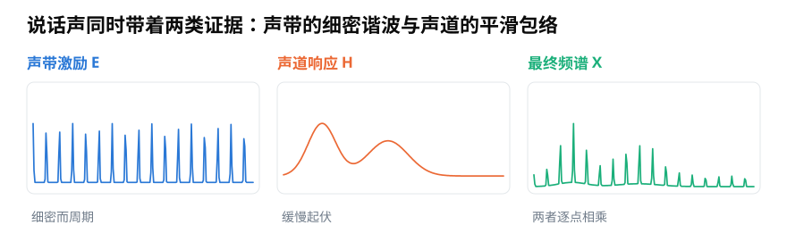
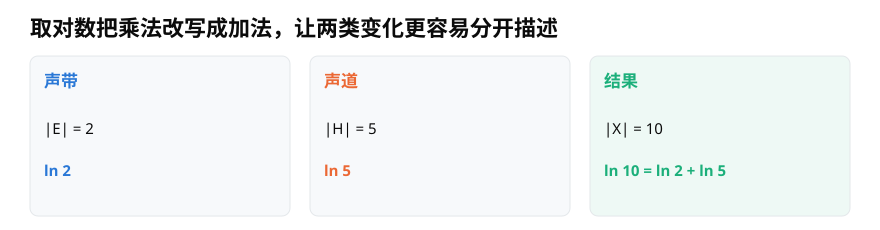
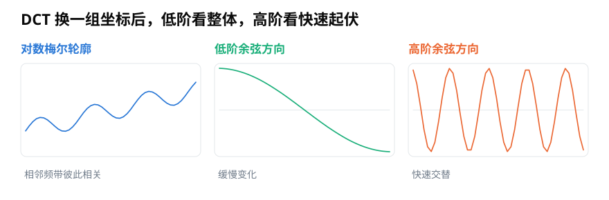

# MFCC 中的对数与 DCT：为什么少量系数能概括频谱轮廓？

> **导读：** MFCC 不是“再画一种声谱图”，而是把每一帧对数梅尔频谱压缩成少量数字。本文用说话声中的声带激励与声道共鸣解释取对数的作用，再说明 DCT 为什么把平滑轮廓集中到低阶系数，以及丢掉高阶系数会损失什么。
>
> **读完能做到：** 说出取对数把什么关系变成了加法　·　解释 DCT 为什么能把轮廓集中到前几项　·　知道只保留 13 项丢掉了什么

<picture>
  <source media="(max-width: 640px)" srcset="figures/mobile/00-course-position-19.svg">
  
</picture>

同一个人说不同元音时，声带仍在一张一合地重复运动，但舌头、嘴唇和口腔形状会改变某些声音成分的共鸣。把这些成分从低到高排开，会同时看到两类线索：密集的细纹，以及缓慢起伏的整体轮廓。

这里先采用一种便于理解的简化说法：把声带提供的重复推动称为**声源激励**；把声音经过喉咙、口腔和鼻腔时受到的塑形称为**声道响应**。把每种振动快慢的强弱排成一条曲线，得到的图叫**频谱**，它同时带着两者的影响。

<picture>
  <source media="(max-width: 640px)" srcset="figures/mobile/19-source-filter.svg">
  
</picture>

*图 1：左图的密集尖峰来自声带的重复推动，中图的平滑起伏表示共鸣轮廓；两者逐点相乘，得到右侧曲线。*

MFCC 想保留的主要不是每一根细纹，而是较稳定的整体轮廓。为此，它先用对数改写声源与声道的关系，再用 DCT 换一组更适合压缩的坐标。

## 取对数，把乘法关系改成加法

声音经过声道塑形，可以先用下面的简化关系表示。时域中的星号表示一种把两段信号组合起来的运算，专业名称是卷积：

$$
x(t)=e(t)*h(t)
$$

换到频率表示后，这种组合会变成逐点相乘：

$$
X(f)=E(f)H(f)
$$

再对幅度取对数，乘法便变成加法：

$$
\log\left|X(f)\right|=\log\left|E(f)\right|+\log\left|H(f)\right|
$$

这一步没有自动分离出声带和声道，但让两类影响从“乘在一起”变成“加在一起”，后续的线性变换更容易重新组织它们。

<picture>
  <source media="(max-width: 640px)" srcset="figures/mobile/19-log-add.svg">
  
</picture>

*图 2：若声源贡献为 2、声道贡献为 5，结果为 10；取自然对数后，`ln 10` 等于 `ln 2` 加 `ln 5`。对数改变的是关系的写法。*

MFCC 实际操作的通常不是完整线性频谱，而是上一篇得到的**对数梅尔频带功率**。梅尔滤波已经汇总相邻频率，对数又压缩了强弱范围，接下来才轮到 DCT。

## DCT 把平滑轮廓集中到前面

相邻梅尔频带往往很像：一个频带较强，旁边几个频带通常也不会突然完全相反。这种一起变化的现象叫相关。

**离散余弦变换**，简称 **DCT**，会用一组从缓慢到快速起伏的余弦形状，重新描述这一列对数梅尔数据。第 $n$ 个输出系数可以写成：

$$
c_n=\sum_{m=0}^{M-1}L_m\cos\left[\frac{\pi n}{M}\left(m+\frac{1}{2}\right)\right]
$$

$L_m$ 是第 $m$ 个对数梅尔频带的值，$c_n$ 是换坐标后的第 $n$ 个系数。低阶余弦变化缓慢，适合描述整体斜率和宽阔起伏；高阶余弦快速交替，负责较细的频带变化。

<picture>
  <source media="(max-width: 640px)" srcset="figures/mobile/19-dct.svg">
  
</picture>

*图 3：平滑轮廓通常更容易由少量低阶方向概括；快速起伏需要较高阶方向。DCT 是可逆的换坐标，只有随后丢掉系数才发生信息损失。*

这也是 MFCC 中“倒谱系数”这个名称的来源之一。不过，严格倒谱常对完整对数频谱做逆傅里叶变换；MFCC 是对**对数梅尔频带**做 DCT。两者思想相关，但计算对象并不完全相同。

## 保留前 13 项是一种有损选择

一条常见 MFCC 管线先得到 40 个对数梅尔频带，再做 DCT，最后只保留前 13 个系数。

<picture>
  <source media="(max-width: 640px)" srcset="figures/mobile/19-mfcc-pipeline.svg">
  
</picture>

*图 4：梅尔汇总先减少频率行数，对数改写强弱关系，DCT 再换坐标。只保留前若干项是一种有损压缩，不是无条件正确的固定规则。*

13 来自经典语音系统中的常见经验，并不是听觉系统规定的常数。保留较少系数会突出平滑轮廓，也会丢掉快速频带变化；保留较多系数能留下更多细节，同时可能带入任务不需要的变化。

第 0 个系数通常与这一帧的整体能量关系很强。有的系统保留它，有的系统用单独的能量值替代，具体做法必须记录。DCT 的类型和归一化方式同样会改变数值，不能只比较“都是 13 维”。

MFCC 也不是自动降噪器。背景噪声、混响和录音设备都可能改变频谱轮廓，从而改变低阶系数。截掉高阶项只是减少细碎变化，不能保证剩下的全是语音内容。

## 小结

MFCC 的压缩逻辑可以顺着三句话理解：梅尔滤波把线性频率汇总成较符合听感的频带；取对数把相乘的影响改写成相加，并压缩强弱范围；DCT 把平滑轮廓集中到较低阶位置。最后保留多少项，应由任务和验证结果决定，而不是机械照搬 13。

<!-- exercise:start -->

## 动手做：第 19 步 · 看看 DCT 到底压掉了什么

课程项目《三首曲子，一个分类器》共 23 步，这是第 19 步。MFCC 只保留前 13 个系数。这一步的目的不是实现它，而是亲眼确认"扔掉后面那些"到底损失了多少。

1. 取一帧对数梅尔谱，对它做 DCT，把 64 个系数按大小画成柱状图。
2. 只保留前 13 个系数，其余置零，再做逆 DCT 还原成 64 维，和原始曲线画在一起。
3. 把保留数量改成 5、13、26、40，各还原一次，观察曲线什么时候开始明显失真。

**做完应该有**：一张"保留不同数量系数"的还原对比图。

**自检**：保留 13 个时，还原曲线应该抓住了整体起伏但丢掉了细小的锯齿。如果保留 13 个就几乎完全重合，说明你选的那一帧太平滑，换一帧高频丰富的再试。

上一步：[第 18 课 · 提取对数梅尔频谱](18-用Python提取对数梅尔频谱-怎样固定参数与输出形状.md)　·　下一步：[第 20 课 · 算出 39 维 MFCC](20-用Python构建MFCC动态特征-Delta与39维拼接.md)　·　[项目全貌](../课程项目/README.md)

<!-- exercise:end -->
