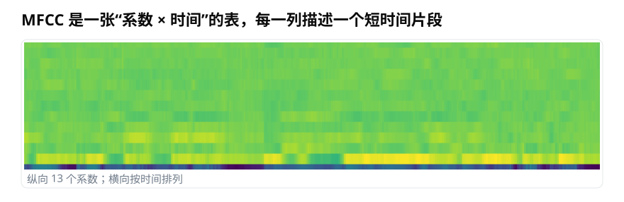
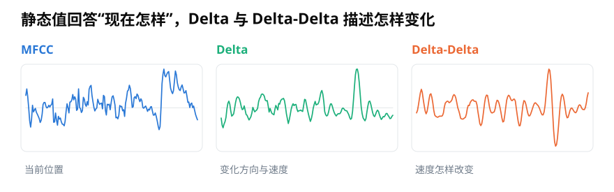

# 用 Python 构建 MFCC 动态特征：Delta 与 39 维拼接

> **导读：** 一列 MFCC 只能描述一个短时间片段“现在的频谱轮廓”，没有直接说明它正怎样变化。本文用 Python 计算 13 维 MFCC、一阶 Delta 和二阶 Delta，解释差分窗口与边界处理，并把三组结果拼成每帧 39 维的特征。

<picture>
  <source media="(max-width: 640px)" srcset="figures/mobile/00-course-position-20.svg">
  
</picture>

说出一个音节时，嘴形和口腔内部不会停在一个位置：它们会进入、过渡，再离开。若只看某一帧 MFCC，我们能知道这一刻各种声音成分的强弱轮廓，却不容易区分“正在上升”和“正在下降”。

一段 MFCC 可以排成一张表。每一列对应一个短时间片段，每一行对应一个系数。

<picture>
  <source media="(max-width: 640px)" srcset="figures/mobile/20-mfcc-map.svg">
  
</picture>

*图 1：颜色展示每个系数随时间的数值。单独一列描述当前位置；连续多列放在一起，才能看见变化方向。*

## Delta 用邻近帧估计变化

传统语音系统常在 MFCC 旁边增加**一阶差分**，英文常写作 **Delta**。它不是简单用后一帧减前一帧，而是在一个短窗口内做局部拟合，估计变化方向和速度。

一种常见写法是：

$$
\Delta c_t=\frac{\sum_{n=1}^{N}n\left(c_{t+n}-c_{t-n}\right)}{2\sum_{n=1}^{N}n^2}
$$

$c_t$ 是当前帧某个 MFCC 系数，左右各取 $N$ 帧。若只看左右各一帧，公式变为：

$$
\Delta c_t=\frac{c_{t+1}-c_{t-1}}{2}
$$

例如三帧数值依次为 2、5、8，中心帧的 Delta 是 3，表示数值正在上升。再对变化速度求一次差分，得到**二阶差分**，也叫 **Delta-Delta**，它强调速度本身怎样改变。

<picture>
  <source media="(max-width: 640px)" srcset="figures/mobile/20-delta.svg">
  
</picture>

*图 2：MFCC 回答“现在在哪里”，Delta 突出变化方向与速度，Delta-Delta 对突然转折更敏感。三条曲线的数值单位和范围并不相同。*

`librosa.feature.delta()` 的 `width` 表示参与局部估计的帧数，必须是大于等于 3 的正奇数，而且不能超过可用时间帧数。窗口越宽，结果通常越平滑，观察的变化时间尺度也越长。`order=1` 计算一阶变化，`order=2` 计算二阶变化。

## 居中差分会用到未来帧

离线计算常把当前帧放在差分窗口中央，因此同时看左边的过去帧和右边的未来帧。这样时间位置对称，但实时系统在当前时刻还没有收到未来声音。

<picture>
  <source media="(max-width: 640px)" srcset="figures/mobile/20-boundary.svg">
  
</picture>

*图 3：离线居中窗口需要等待未来帧；实时因果窗口只看当前与过去，但它得到的数值定义已经改变。边界补值方式也会影响开头和结尾。*

库函数还要处理录音两端缺少邻居的情况。`mode="interp"` 会在边缘进行局部拟合；其他模式可能复制、镜像或填常数。训练和推理若使用不同模式，边缘帧会不一致。

真正的实时系统有两种选择：等待右侧帧到齐，接受固定延迟；或者改用只看过去的因果差分。后者不是把 `mode` 换一个名字就完成，而是要明确改变计算窗口，并用同一规则重新训练或验证模型。

## 三组 13 维拼成每帧 39 维

静态 MFCC、Delta 和 Delta-Delta 的形状都为 $13\times T$。沿“系数”方向上下拼接后，时间列数不变，得到 $39\times T$：

$$
F_t=\begin{bmatrix}c_t & \Delta c_t & \Delta^2c_t\end{bmatrix}\in\mathbb{R}^{39}
$$

<picture>
  <source media="(max-width: 640px)" srcset="figures/mobile/20-concat.svg">
  
</picture>

*图 4：三张表拥有相同的时间列。拼接只增加每一帧的特征通道，不会增加录音时长或时间帧数。*

下面的代码显式生成对数梅尔谱，再计算 MFCC 与动态特征。这样前端每一步的参数都能被记录：

```python
import librosa
import numpy as np

TARGET_SR = 16000
N_FFT = 512
HOP_LENGTH = 160
N_MELS = 40
N_MFCC = 13
DELTA_WIDTH = 9

y, sr = librosa.load("audio.wav", sr=TARGET_SR, mono=True)

mel_power = librosa.feature.melspectrogram(
    y=y,
    sr=sr,
    n_fft=N_FFT,
    win_length=N_FFT,
    hop_length=HOP_LENGTH,
    window="hann",
    center=False,
    power=2.0,
    n_mels=N_MELS,
    fmin=50,
    fmax=sr / 2,
    htk=False,
    norm="slaney",
)

log_mel = librosa.power_to_db(mel_power, ref=np.max, top_db=80)

mfcc = librosa.feature.mfcc(
    S=log_mel,
    n_mfcc=N_MFCC,
    dct_type=2,
    norm="ortho",
)

delta = librosa.feature.delta(
    mfcc,
    width=DELTA_WIDTH,
    order=1,
    mode="interp",
)
delta2 = librosa.feature.delta(
    mfcc,
    width=DELTA_WIDTH,
    order=2,
    mode="interp",
)

features = np.vstack([mfcc, delta, delta2]).T
print(features.shape)  # (时间帧数, 39)
```

代码最后转置，是因为不少机器学习程序习惯让每一行对应一个时间帧，即形状写成 $T\times39$。如果某段录音少于 9 帧，`width=9` 无法使用；应先规定最短输入长度，或根据场景设计另一套短片段处理方式。

许多流程还会对每个特征通道做均值和方差归一化。统计量只能由训练集计算，再原样用于验证集、测试集和部署数据；若用测试数据重新计算，就会把本不该提前知道的信息带入模型评估。

最后，39 维是经典方案，不是强制标准。RNN、卷积网络和 Transformer 等能够跨多帧学习变化，手工 Delta 未必总能提高效果。是否保留它，应通过同一数据划分上的对照实验决定，同时考虑实时延迟与计算成本。

## 小结

MFCC 描述每帧的频谱轮廓，Delta 描述局部变化，Delta-Delta 描述变化速度怎样改变。把三者拼接会得到每帧 39 维，但也引入差分窗口、边界模式和未来帧依赖。只要这些选择没有固定，两个都叫“39 维 MFCC”的系统仍可能产生不同结果。

<!-- exercise:start -->

## 动手做：第 20 步 · 算出 39 维 MFCC

课程项目《三首曲子，一个分类器》共 23 步，这是第 20 步。把静态系数和变化量拼在一起，这是这套课程里维度最高、也最常用的一份特征。

1. 实现 `mfcc39(y, ...)`：13 维 MFCC + 13 维一阶差分 + 13 维二阶差分，拼成每帧 39 维。
2. 按第 20 课的讨论处理边界：居中差分会用到后一帧，第一帧和最后一帧怎么算？在注释里写明。
3. 对 `dataset.csv` 每个片段，取 39 维的**逐帧均值**，加进 `features.csv`。
4. 此时 `features.csv` 应有 6 + 39 = 45 列特征。

**做完应该有**：`mfcc39` 函数，以及扩充后的 `features.csv`。

**自检**：39 维中，第 1 维（第 0 号系数）数值应该明显大于其余——它代表整帧的总能量。如果所有维度量级相近，检查是不是漏了对数那一步。

上一步：[第 19 课 · 看看 DCT 到底压掉了什么](19-MFCC中的对数与DCT-为什么少量系数能概括频谱轮廓.md)　·　下一步：[第 21 课 · 想清楚再算：三个统计量各回答什么](../零基础版_21-23/21-频域特征怎样概括一帧声音-带能量比质心与带宽.md)　·　[项目全貌](../课程项目/README.md)

<!-- exercise:end -->
