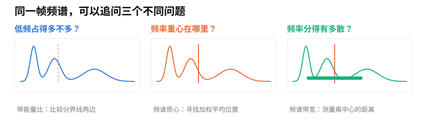
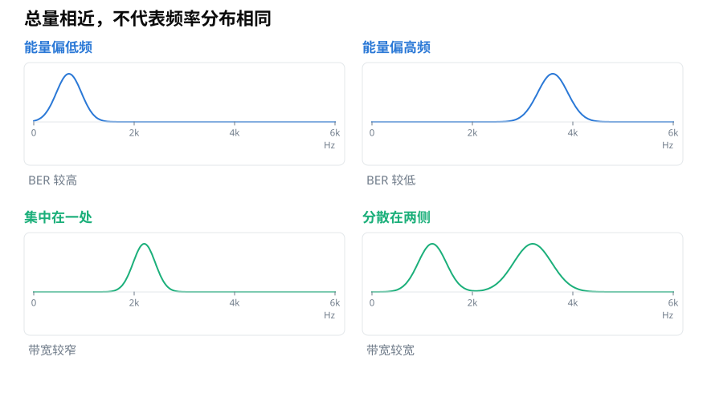

# 频域特征怎样概括一帧声音：带能量比、频谱质心与带宽

> **导读：** 一帧频谱可能有几百个数字，直接交给后续程序并不总是方便。本文从三个直观问题出发，认识带能量比、频谱质心和频谱带宽：低频占多少、频率重心在哪里、声音成分铺得有多开。

<picture>
  <source media="(max-width: 640px)" srcset="figures/mobile/00-course-position-21.svg">
  
</picture>

电脑可以把一小段声音拆成许多“由低到高的位置”，再记录每个位置有多强。这种展示方式叫作**频谱**，横向排列的高低位置就是**频率**。但如果一段录音被切成上百个短片段，每一帧都有几百个位置，逐张观察就不现实了。

这时可以用少量数字概括频谱。这样的数字通常叫作**频域特征**：它们不是复制整张频谱，而是回答任务最关心的问题。

<picture>
  <source media="(max-width: 640px)" srcset="figures/mobile/21-three-questions.svg">
  
</picture>

*图 1：三个特征看的都是频率分布，却分别关心比例、中心位置和分散程度。*

## 低频与高频，哪一边占得更多？

敲一下鼓，声音往往在短时间里把能量铺到较宽的频率范围；某些持续嗡鸣则可能长期集中在低频。若任务关心这种差别，可以先选一条分界线，再比较线两边的声音功率。

低频区功率除以高频区功率，得到**带能量比**（[第 22 课](22-用Python实现带能量比BER-怎样正确切分频率箱.md)会展开），英文缩写为 **BER**。比值大，表示低频一侧更占优势；比值小，表示高频一侧更强。

分界线并没有对所有任务都正确的固定位置。2000 Hz 适合某个数据集，不代表它也适合鸟鸣、机械故障声或语音。它应由任务和数据分布共同决定。

## 频率的“重心”在哪里？

现在换一个问题：如果把频谱想成一把横放的尺子，每个频率位置上的幅度都是压在尺子上的重量，平衡点会落在哪里？

这个加权平均位置叫作**频谱质心**（[第 23 课](23-频谱质心与带宽怎么计算-声音频率的中心与扩散.md)会展开）。高频成分增强时，质心通常向高频移动；低频成分占优时，它通常向低频移动。

质心不是“最强频率”。一张频谱可以在两处都有高峰，而质心落在两峰之间，那里甚至没有明显峰值。它概括的是整幅分布的位置。

## 声音成分围绕中心铺得多开？

只知道中心还不够。两张频谱可能拥有相近的质心，一张紧紧集中在中心附近，另一张却散布在中心两侧。

**频谱带宽**就是用来描述这种分散程度的数字。带宽较小，表示主要成分靠近质心；带宽较大，表示声音成分延伸到更宽的频率范围。

<picture>
  <source media="(max-width: 640px)" srcset="figures/mobile/21-same-total.svg">
  
</picture>

*图 2：总功率相近只能说明整体强弱相近，不能说明频率集中在哪里，也不能说明分布有多宽。*

## 三个数字不能互相代替

给声音补入高频成分时，BER 往往下降，质心往往上升，带宽也可能变大。但如果把整幅频谱原样向高频移动，质心会上升，带宽却可以几乎不变。若只把分布向两侧拉开，带宽会增大，质心则可能仍在原处。

<picture>
  <source media="(max-width: 640px)" srcset="figures/mobile/21-feature-response.svg">
  
</picture>

*图 3：箭头表示常见变化方向，不是对所有声音都成立的硬规则。真实结果仍取决于原来的频谱和分界线。*

因此，不能笼统地问“哪个特征最好”。更有用的问题是：后续程序需要辨认的差别，究竟表现为低频与高频的比例、整体位置的移动，还是分散范围的变化？

<picture>
  <source media="(max-width: 640px)" srcset="figures/mobile/21-task-map.svg">
  
</picture>

*图 4：先写出任务真正需要的证据，再选择特征，通常比先堆很多数字更可靠。*

## 计算前还要记住一个约定

质心和带宽都需要给频谱上的数值分配权重。可以直接把每个位置的强弱作为重量，这叫使用**幅度谱**；也可以先把这些数值平方，这叫使用**功率谱**。两种做法都能定义出合理的统计量，却会得到不同数值。

所以，记录特征时不能只写“频谱质心”，还要写清楚输入是幅度谱还是功率谱。后文使用 Librosa 的默认做法，以幅度谱计算质心和带宽；BER 则比较功率，因为它讨论的是两段频带中的能量。

这三个数字也不会保留频谱的全部细节。两段不同声音可能得到相近的 BER、质心和带宽，因此它们常与其他特征一起使用。特征的作用是突出证据，不是把整段声音无损压缩成三个答案。

## 小结

带能量比回答“低频与高频哪边更强”，频谱质心回答“频率分布的中心在哪里”，频谱带宽回答“声音成分离中心有多散”。理解这三个问题后，下一步才是把频率分界线准确落到计算机的频率格上，并逐帧算出 BER。

<!-- exercise:start -->

## 动手做：第 21 步 · 想清楚再算：三个统计量各回答什么

课程项目《三首曲子，一个分类器》共 23 步，这是第 21 步。这一步只写字不写代码。三个数字看起来都在描述"频谱长什么样"，但它们回答的是不同的问题。

1. 用一句话分别写出：带能量比、频谱质心、频谱带宽，各自回答关于三种风格的什么问题。
2. 对每一个，预测三种风格的相对大小（谁高谁低），并写下理由。
3. 在 `notes/21-预测.md` 里记下这三条预测——第 23 课会用实际数据验证。

**做完应该有**：三条带理由的预测。

**自检**：一个合理的预测是：摇滚的质心最高、带宽最大，古典最低最窄。如果你说不出理由，回去重读第 21 课"三个数字不能互相代替"那一节。

上一步：[第 20 课 · 算出 39 维 MFCC](../零基础版_16-20/20-用Python构建MFCC动态特征-Delta与39维拼接.md)　·　下一步：[第 22 课 · 实现带能量比](22-用Python实现带能量比BER-怎样正确切分频率箱.md)　·　[项目全貌](../课程项目/README.md)

<!-- exercise:end -->
