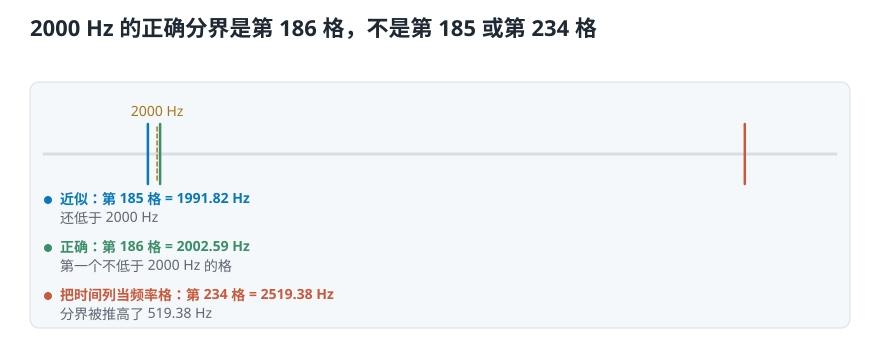
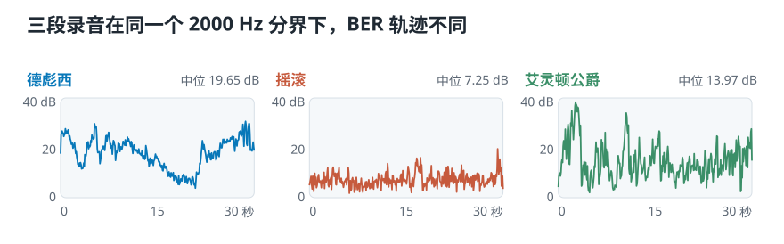
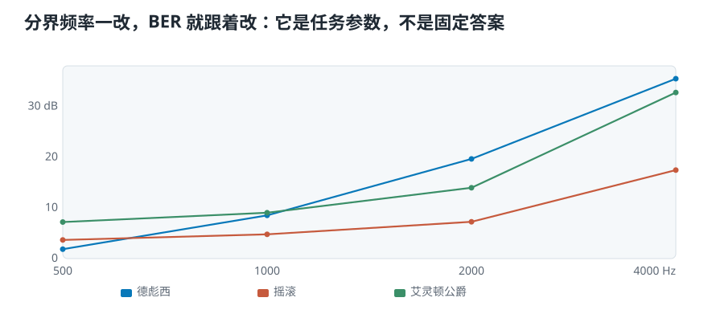

# 用 Python 实现带能量比：2000 Hz 到底该切在哪一格

> **导读：** BER 的公式只有一个除法，代码却有两个不报错的陷阱：把“时间帧数”当成“频率格数”，以及用近似格距把 2000 Hz 切到错误一侧。本课用三段 30 秒音乐逐帧计算 BER。正确分界是第 **186** 格；一旦把 1292 个时间帧误当成频率格数，分界会跑到第 **234** 格，也就是实际约 **2519 Hz**。德彪西那段的中位 BER 会因此多出 **4.37 dB**。

<picture>
  <source media="(max-width: 640px)" srcset="figures/mobile/00-course-position-22.svg">
  
</picture>

完整代码在[第 22 课脚本](../课程代码/lessons/lesson22_band_energy_ratio.py)，公共函数在[frequency_features.py](../课程代码/soundlab/frequency_features.py)。运行环境沿用[课程总纲](../课程总纲/README.md)里的一次性配置。

## 这一课要完成什么实验

三段课程音乐各取前 30 秒，参数统一为：

```text
采样率       22050 Hz
帧长         2048 个样本（92.9 毫秒）
帧移          512 个样本（23.2 毫秒）
分界频率      2000 Hz
```

实验分四步：载入三段音乐、做 STFT、找 2000 Hz 对应的分界格、逐帧累计两侧功率。最后再故意把矩阵轴写错一次，量出这个错误会改变多少。

## 先得到三张功率声谱图

```python
S = librosa.stft(y, n_fft=2048, hop_length=512)
power = np.abs(S) ** 2
print(S.shape)
```

三段音乐得到的形状相同：

```text
debussy  -> (1025, 1292)
redhot   -> (1025, 1292)
duke     -> (1025, 1292)
```

**1025 行是频率格，1292 列是时间帧。** 这个方向必须先说清楚：BER 要保留每一个时间列，把同一列里的低频行相加、高频行相加。

<picture>
  <source media="(max-width: 640px)" srcset="figures/mobile/22-ber-axis-contract.svg">
  
</picture>

图里写的“沿频率方向相加”，在 NumPy 里是 `axis=0`。它会把 1025 行压成 1 行，1292 个时间位置一个都不丢。

## 2000 Hz 不是拿除法猜出来的

2048 点 rFFT 的每格间距是

$$
\Delta f = \frac{22050}{2048} \approx 10.7666\ \text{Hz}
$$

2000 除以 10.7666 约等于 185.76。这个数不是格号答案，它只说明 2000 Hz 落在第 185 格和第 186 格之间。

本课约定低侧严格小于 2000 Hz，高侧大于或等于 2000 Hz，所以应该找**第一个不低于 2000 Hz 的频率格**：

```python
frequencies = np.fft.rfftfreq(2048, d=1 / 22050)
split_bin = np.searchsorted(frequencies, 2000, side="left")
```

结果是：

```text
第 185 格 = 1991.82 Hz   仍在低侧
第 186 格 = 2002.59 Hz   高频侧第一格
```

因此低侧取 `power[:186]`，高侧取 `power[186:]`。两块没有重叠，也没有漏掉一行。

<picture>
  <source media="(max-width: 640px)" srcset="figures/mobile/22-split-bin-bug.svg">
  
</picture>

为什么不用“奈奎斯特频率除以频率格数”来估？因为 rFFT 的 1025 格**包含 0 Hz 和奈奎斯特两个端点**，相邻格只有 1024 段。直接生成真实频率轴，更清楚，也不会出现少一格的问题。

## 把公式写成四行代码

```python
power = np.abs(S) ** 2
split = np.searchsorted(frequencies, 2000)
low_energy = power[:split].sum(axis=0)
high_energy = power[split:].sum(axis=0)
ber = low_energy / high_energy
```

向量化结果还要和最笨的逐帧循环核对一次：每一列单独取两段、分别调用 `sum`、再相除。两种写法的最大差是 **5.684e-14**，只剩浮点加法顺序造成的尾数。

原始 BER 是倍数，但真实音乐的比值变化很大，折线容易被少数尖峰压扁。画图时把它写成 dB：

$$
\operatorname{BER}_{\mathrm{dB}}
= 10\log_{10}\left(\frac{E_{\mathrm{low}}}{E_{\mathrm{high}}}\right)
$$

- 0 dB：两侧功率相等；
- 正值：低频侧更多；
- 负值：高频侧更多。

公式仍然是同一个比值，只是换了更容易画的刻度。

## 三段音乐的结果

<picture>
  <source media="(max-width: 640px)" srcset="figures/mobile/22-ber-tracks-new.svg">
  
</picture>

每段 1292 帧，不能只看一两个尖峰。用中位数表示典型位置，再用第 25% 到第 75% 分位表示中间一半：

| 录音 | 中位 BER | 中间一半 |
|---|---:|---:|
| 德彪西 | 19.65 dB | 14.64—23.56 dB |
| 摇滚 | 7.25 dB | 5.35—9.32 dB |
| 艾灵顿公爵 | 13.97 dB | 9.88—19.66 dB |

在这三段录音、这个 2000 Hz 分界下，德彪西低频侧相对最多，摇滚最少。但课程里每类只有一段音乐，**这只能描述三个样本，不能宣布整个音乐流派都有同样规律。**

## 一个不会报错的轴错误

`S[0]` 是第一行，长度是 1292——也就是时间帧数。若把 `len(S[0])` 当成频率格数，程序不会崩溃，却会算出第 234 格。放回真实频率轴一看：

```text
第 234 格 = 2519.38 Hz
```

也就是说，代码嘴上写 2000 Hz，实际却按约 2519 Hz 分开。错误分界把更多能量算进低频侧，所以三段的中位 BER 都被抬高：

| 录音 | 正确分界 | 错误分界 | 改变量 |
|---|---:|---:|---:|
| 德彪西 | 19.65 dB | 24.02 dB | +4.37 dB |
| 摇滚 | 7.25 dB | 9.09 dB | +1.83 dB |
| 艾灵顿公爵 | 13.97 dB | 19.94 dB | +5.97 dB |

这就是为什么频率轴和矩阵方向不能靠记忆猜。**先打印 shape，再打印分界格对应的真实 Hz**，两个检查足以抓住大多数 BER 错误。

## 分界频率一改，结论也会动

<picture>
  <source media="(max-width: 640px)" srcset="figures/mobile/22-threshold-scan.svg">
  
</picture>

| 分界 | 德彪西 | 摇滚 | 艾灵顿公爵 |
|---:|---:|---:|---:|
| 500 Hz | 1.85 dB | 3.68 dB | 7.21 dB |
| 1000 Hz | 8.52 dB | 4.79 dB | 9.05 dB |
| 2000 Hz | 19.65 dB | 7.25 dB | 13.97 dB |
| 4000 Hz | 35.46 dB | 17.45 dB | 32.74 dB |

分界从 500 Hz 改到 2000 Hz，三段的先后顺序都变了。BER 不是声音自带的唯一号码，它是**在你指定的频率分界下**回答问题。选分界应该跟任务有关，不能因为某篇示例用了 2000 Hz，就把它当成通用常数。

## 这一课得到了什么，下一课接着讲什么

这一课从头实现了 BER，最重要的不是最后那一行除法，而是前面的两个约定：

1. `(1025, 1292)` 中，1025 行是频率，1292 列是时间；
2. 低侧取 `< 2000 Hz`，高侧取 `>= 2000 Hz`，因此正确分界是第 **186** 格。

写错矩阵轴时，2000 Hz 会悄悄跑到实际 **2519.38 Hz**；三段录音的中位 BER 会被抬高 **1.83—5.97 dB**。参数本身也会改变答案：分界从 500 Hz 扫到 4000 Hz，三段曲线的相对位置并不固定。

[下一课](23-频谱质心与带宽-怎样量出中心和展开.md)实现另外两个频域特征：先让库算出质心和带宽，再把两行函数手写出来逐帧核对。那里还有一处定义差异要解决：同样叫“带宽”，$p=1$ 和库默认的 $p=2$ 并不是同一个数。
