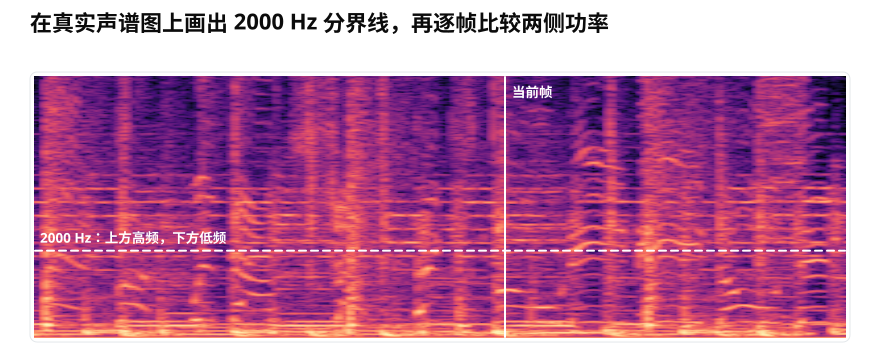
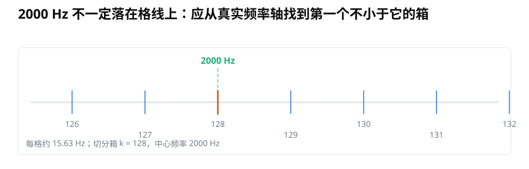

# 用 Python 实现带能量比（BER）：怎样正确切分频率箱？

> **导读：** BER 比较一帧声音中低频与高频的功率。真正容易出错的不是除法，而是把 2000 Hz 正确换成频率箱、沿正确方向求和，并处理高频功率接近零的帧。本文把这些步骤写成一段可复查的 Python 代码。

假设我们想观察一段音乐中，较低的声音成分何时占优势。电脑可以把录音排成一张图：每一列是一个短时间片段，每一行代表一个由低到高的位置。这张图叫作**声谱图**，这些高低位置表示声音每秒振动多少次，也就是**频率**。

BER 的做法很直接。对每一列，把分界线下方的功率相加，再除以分界线上方的功率。

<picture>
  <source media="(max-width: 640px)" srcset="figures/mobile/22-split-frame.svg">
  
</picture>

*图 1：白色竖线表示某一帧。BER 不是比较整张图，而是为每个时间列分别比较低频区和高频区。*

## 先把比值写清楚

把一帧中分界线以下的总功率记作低频功率，分界线以上的总功率记作高频功率。原始比值为：

$$
R_t=\frac{E_{\mathrm{low},t}}{E_{\mathrm{high},t}}
$$

这里的下标 `t` 表示第几个时间片段。`R_t` 大于 1，说明这一帧的低频功率更多；小于 1，说明高频功率更多。

原始比值可能从很小跳到非常大，不容易放在同一张图上。常见做法是把它换成分贝：

$$
B_t=10\log_{10}\left(\frac{E_{\mathrm{low},t}+\varepsilon}{E_{\mathrm{high},t}+\varepsilon}\right)
$$

此时 0 dB 表示两侧功率相等，正数表示低频占优，负数表示高频占优。很小的正数 `epsilon` 只用来避免某一侧接近零时发生除零；它不应大到改变正常声音帧的结果。

## 2000 Hz 要落到哪一个频率箱？

短时傅里叶变换把频率排成一个个离散位置，也就是**频率箱**。当采样率为 16000 Hz、每帧做 1024 点变换时，相邻频率箱相差 15.625 Hz。2000 Hz 恰好落在第 128 箱；换一组参数后，它未必仍然正好落在格线上。

<picture>
  <source media="(max-width: 640px)" srcset="figures/mobile/22-bin-map.svg">
  
</picture>

*图 2：不要凭矩阵长度猜频率。先生成每一行对应的真实赫兹值，再找到第一个不小于分界频率的位置。*

NumPy 的 `rfftfreq` 会根据变换长度和采样率生成频率轴，`searchsorted` 再寻找插入位置：

```python
frequencies = np.fft.rfftfreq(n_fft, d=1 / sr)
split_bin = np.searchsorted(frequencies, split_hz, side="left")
```

这种写法还有一个好处：代码直接表达了“寻找第一个不小于 2000 Hz 的频率箱”，不必手动近似每格宽度。

## 最容易写错的是矩阵方向

Librosa 返回的短时傅里叶结果形状为“频率箱数 × 时间帧数”。例如 `n_fft=1024` 时，非负频率共有 513 行；列数由录音时长和每次移动多少采样点决定。

<picture>
  <source media="(max-width: 640px)" srcset="figures/mobile/22-axis-flow.svg">
  
</picture>

*图 3：沿频率行求和会保留时间列，最后得到长度为时间帧数的一条曲线。若误沿时间列求和，结果就不再表示逐帧 BER。*

因此，切分时操作第一个轴，求和也沿第一个轴：

```python
low_power = power[:split_bin, :].sum(axis=0)
high_power = power[split_bin:, :].sum(axis=0)
```

不要用 `len(spectrogram[0])` 推断频率箱数。对于“频率 × 时间”的矩阵，第一行的长度是时间帧数，不是频率箱数。最稳妥的检查是直接打印 `power.shape`，并让频率轴长度等于 `power.shape[0]`。

## 一段可以直接复查的实现

```python
import librosa
import numpy as np

TARGET_SR = 16000
N_FFT = 1024
HOP_LENGTH = 256
SPLIT_HZ = 2000.0

y, sr = librosa.load("audio.wav", sr=TARGET_SR, mono=True)

stft_matrix = librosa.stft(
    y,
    n_fft=N_FFT,
    win_length=N_FFT,
    hop_length=HOP_LENGTH,
    window="hann",
    center=False,
)
power = np.abs(stft_matrix) ** 2

frequencies = np.fft.rfftfreq(N_FFT, d=1 / sr)
split_bin = np.searchsorted(frequencies, SPLIT_HZ, side="left")

if not 0 < split_bin < power.shape[0]:
    raise ValueError("分界频率必须位于 0 Hz 与奈奎斯特频率之间")
if len(frequencies) != power.shape[0]:
    raise ValueError("频率轴与功率声谱图的行数不一致")

low_power = power[:split_bin, :].sum(axis=0)
high_power = power[split_bin:, :].sum(axis=0)

epsilon = np.finfo(power.dtype).eps
ber_db = 10 * np.log10(
    (low_power + epsilon) / (high_power + epsilon)
)

times = np.arange(power.shape[1]) * HOP_LENGTH / sr
print(power.shape, frequencies.shape, ber_db.shape, times.shape)
```

这里把 `center` 设为 `False`，所以第一帧从录音开头开始。时间数组按每一列向前移动 `HOP_LENGTH` 个采样点来计算。如果改用默认的居中补边方式，帧的边界含义也会改变，应在训练和使用时保持一致。

## 读曲线时不要忘记参数

<picture>
  <source media="(max-width: 640px)" srcset="figures/mobile/22-ber-curves.svg">
  
</picture>

*图 4：三段课程音乐都使用 16000 Hz 采样率、1024 点变换、256 点步长和 2000 Hz 分界线。曲线差异来自声音，也会受这些设置影响。*

BER 不是固定不变的“声音身份证”。改变分界频率会重新划分两侧功率；改变采样率、变换长度和窗口会改变频率格与时间平滑程度；录音设备的频率响应也会改变高低频比例。

因此，保存结果时至少要一起记录采样率、`n_fft`、步长、窗口、是否居中、分界频率、功率定义和稳定项。只有参数一致，两条 BER 曲线才适合直接比较。

## 小结

实现 BER 的关键不是写出一个除法，而是保持单位和矩阵方向一致：用真实频率轴把赫兹换成频率箱，沿频率方向分别求和，再用稳定的对数比值展示逐帧结果。下一篇将沿用同一张幅度谱，计算频率分布的中心与扩散程度。
