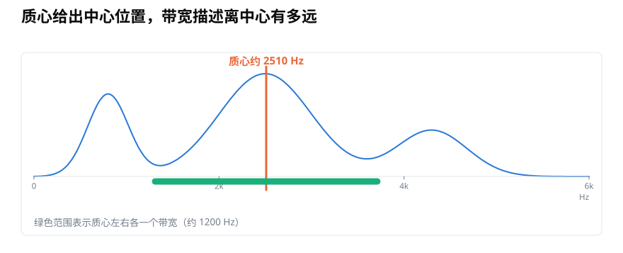
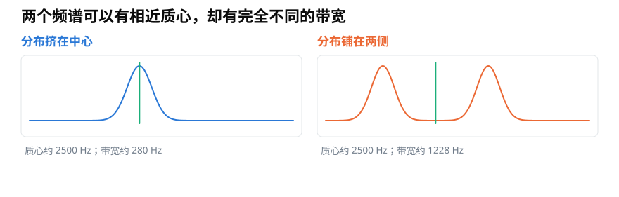
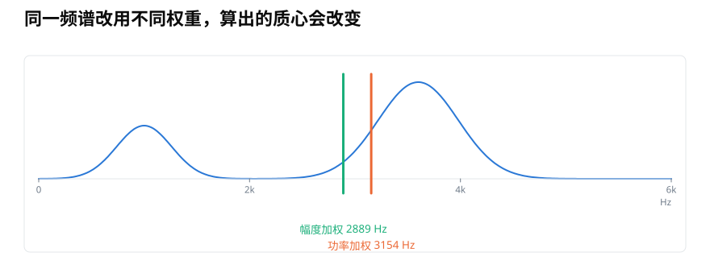
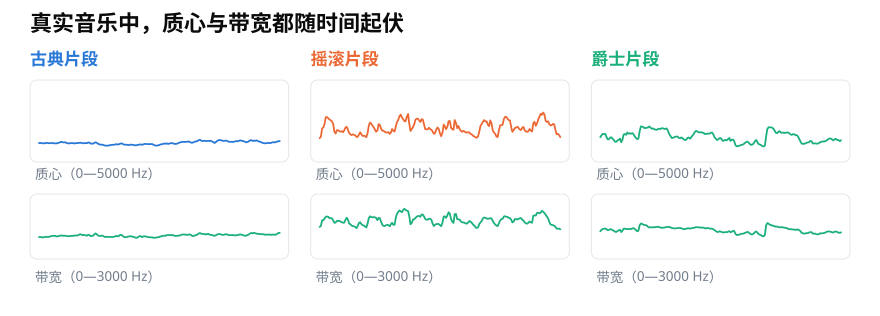

# 频谱质心与带宽：怎样量出声音频率的中心与扩散？

> **导读：** 频谱质心把一帧声音概括为频率分布的加权中心，频谱带宽再说明成分离这个中心有多远。本文从图形直觉走到公式和 Librosa 实现，并解释为什么权重口径、静音帧和录音条件都会影响结果。
>
> **读完能做到：** 算出频谱质心与带宽　·　说明用幅度还是功率作权重　·　知道质心高不等于听起来一定亮

<picture>
  <source media="(max-width: 640px)" srcset="figures/mobile/00-course-position-23.svg">
  
</picture>

电脑可以把一小段声音按“从低到高”排开，并记录每个位置有多强。这样得到的图叫作**频谱**，图上的高低位置表示声音每秒振动多少次，也就是**频率**。一帧频谱可能有多个峰，只报告最强位置会忽略其余成分。

我们可以寻找整幅分布的加权中心，这叫作**频谱质心**；再测量各处离中心的典型距离，这叫作**频谱带宽**。

<picture>
  <source media="(max-width: 640px)" srcset="figures/mobile/23-centroid-bandwidth.svg">
  
</picture>

*图 1：橙线是加权中心；绿色横线表示围绕中心的典型扩散距离。它们分别回答“在哪里”和“有多散”。*

## 质心是所有频率位置的加权平均

普通平均会把每个频率位置看得同样重要，这不符合频谱：很弱的位置不应和很强的位置拥有相同影响。质心因此使用频谱幅度作为权重：

$$
C_t=\frac{\sum_k f_k S_{k,t}}{\sum_k S_{k,t}}
$$

`f_k` 是第 `k` 个频率箱对应的赫兹值，`S_{k,t}` 是第 `t` 帧在这个位置上的幅度。幅度越大，它越能把质心拉向自己的频率位置。

例如，一帧声音主要集中在 1000 Hz，另有少量成分位于 4000 Hz，那么质心通常会高于 1000 Hz，却不会直接跳到 4000 Hz。它也不一定落在某个频谱峰上。

## 相同质心不代表相同频谱

如果两边的成分大致对称，两张频谱可以拥有相近质心。一张可能紧挨中心，另一张则远远分布在两侧。只看质心，无法区分它们。

<picture>
  <source media="(max-width: 640px)" srcset="figures/mobile/23-same-centroid.svg">
  
</picture>

*图 2：两条绿线位置几乎一样，说明质心相近；右图的成分离中心更远，因此带宽明显更大。*

常见的频谱带宽使用平方距离，计算方式与标准差相似：

$$
W_t=\sqrt{\frac{\sum_k S_{k,t}\left(f_k-C_t\right)^2}{\sum_k S_{k,t}}}
$$

远离质心的位置会因为距离被平方而受到更大重视。带宽的单位仍是 Hz。它不是“最低频率到最高频率”的简单跨度，也不是滤波器的通带宽度。

## 幅度还是功率，必须提前约定

上面的公式使用幅度 `S` 作为权重，这也是 Librosa 在接收幅度谱时的常见做法。另一种实现会把幅度平方，用功率作为权重。强峰被平方后影响更大，因此两种口径会得到不同的质心和带宽。

<picture>
  <source media="(max-width: 640px)" srcset="figures/mobile/23-weight-convention.svg">
  
</picture>

*图 3：这不是谁算错了，而是权重定义不同。训练、验证、部署和复现实验必须使用同一种口径。*

第 22 篇的 BER 使用功率，因为它比较两个频带中的能量；本文的质心与带宽使用幅度，以便与下面的 Librosa 调用保持一致。不要把功率声谱图直接传入参数 `S`，同时又把结果称作“默认的 Librosa 频谱质心”。

## 用 Librosa 逐帧计算

```python
import librosa
import numpy as np

TARGET_SR = 16000
N_FFT = 1024
HOP_LENGTH = 256

y, sr = librosa.load("audio.wav", sr=TARGET_SR, mono=True)

stft_matrix = librosa.stft(
    y,
    n_fft=N_FFT,
    win_length=N_FFT,
    hop_length=HOP_LENGTH,
    window="hann",
    center=False,
)
magnitude = np.abs(stft_matrix)

centroid = librosa.feature.spectral_centroid(
    S=magnitude,
    sr=sr,
)
bandwidth = librosa.feature.spectral_bandwidth(
    S=magnitude,
    sr=sr,
    centroid=centroid,
    p=2,
    norm=True,
)

times = np.arange(magnitude.shape[1]) * HOP_LENGTH / sr

centroid_hz = centroid[0]
bandwidth_hz = bandwidth[0]

print(magnitude.shape)
print(centroid_hz.shape, bandwidth_hz.shape, times.shape)
```

两个函数返回的形状都是 `1 × 时间帧数`，因此用 `[0]` 取出一维曲线。代码把同一份 `centroid` 传给带宽函数，既少算一次，也确保两步使用同一个中心定义。

参数 `p=2` 表示使用平方距离。`norm=True` 表示每一帧会按总幅度归一化后再计算，因此整体把一帧声音放大两倍，理论上不会把质心和带宽也放大两倍。

<picture>
  <source media="(max-width: 640px)" srcset="figures/mobile/23-tracks.svg">
  
</picture>

*图 4：三段真实音乐使用相同参数。质心与带宽都随时间变化，而且两条曲线并不会始终同步上升或下降。*

## “质心高”不等于完整的听感判断

高质心常与更明亮、更尖锐的听感相关，但这只是一种统计联系。响度、频谱峰的形状、时间变化、听音音量和人的听觉都会影响主观感受。质心相同的两段声音，也可能因为带宽、谐波结构或瞬间变化不同而听起来完全不同。

录音条件同样重要。麦克风若削弱高频，质心可能偏低；高频噪声会把质心和带宽向上拉；压缩编码也可能改变高频细节。因此，跨设备比较前应统一录音和预处理条件。

近乎静音的帧尤其需要留意。此时总幅度接近零，任何加权平均都缺少可靠依据。实际项目可以同时计算每帧能量，对低于阈值的帧标为无效或静音，而不是把一个数值正常的质心当成可信结果。

## 小结

频谱质心是按频谱强度加权后的平均频率，频谱带宽是各频率离质心的典型距离。它们必须使用明确且一致的幅度或功率口径，并与采样率、变换参数、静音处理和录音条件一起记录。至此，我们已经能从一帧频谱中提取比例、中心和扩散三类互补信息。

<!-- exercise:start -->

## 动手做：第 23 步 · 合并全部特征，检验能不能分开

课程项目《三首曲子，一个分类器》共 23 步，这是第 23 步。最后一步。把 23 课积累的东西全部接上，回答那个从第 01 课就提出的问题：这些数字，真的够程序分辨三种风格吗？

1. 实现 `spectral_centroid` 和 `spectral_bandwidth`，注意先声明用幅度还是功率作权重，并与 librosa 的结果对照。
2. 把两者的均值加进 `features.csv`，此时应有 48 列特征。
3. 画一张散点图：横轴质心均值，纵轴带宽均值，三类三色。回到第 21 课那三条预测，逐条核对是对是错。
4. 把 `features.csv` 按 7:3 分成两份，用最近邻做一次判断，算出准确率。（这不是在教机器学习，只是给"特征够不够用"一个参考数字。）
5. 做一次特征消融：只用 6 个时域特征、只用 39 维 MFCC、只用 3 个频域统计量，各算一次准确率。
6. 写 `report.md`：三种风格在哪些特征上差别最大，哪一组特征贡献最多，以及哪些差别是特征本身带来的、哪些可能是数据太少造成的。

**做完应该有**：完整的 `features.csv`、散点图、消融结果表和 `report.md`。

**自检**：三类在质心—带宽平面上应该有明显但不完全的分离。准确率大概率在 80% 以上——但更重要的是消融表：如果只用 6 个时域特征就能到 90%，那说明这份数据太容易，应该换更接近的风格重做一次。**能解释结果，比准确率高更重要。**

上一步：[第 22 课 · 实现带能量比](22-用Python实现带能量比BER-怎样正确切分频率箱.md)　·　[项目全貌](../课程项目/README.md)

<!-- exercise:end -->
