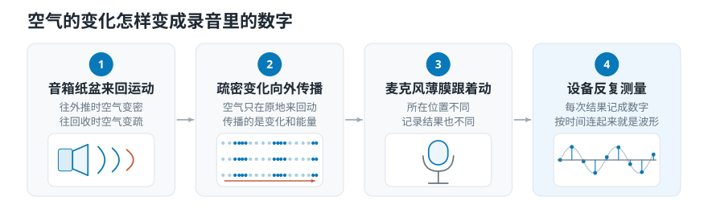
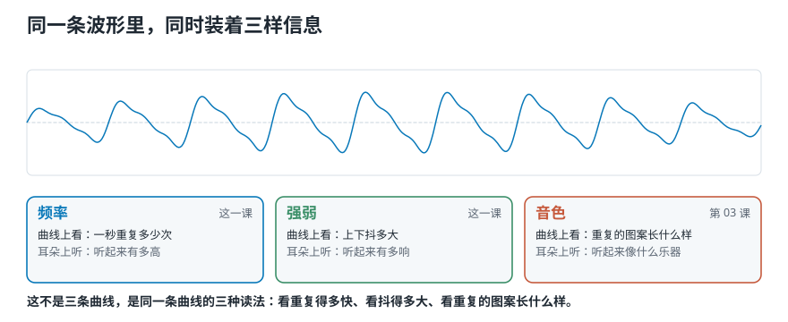
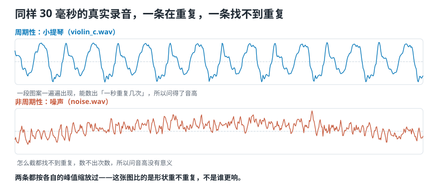
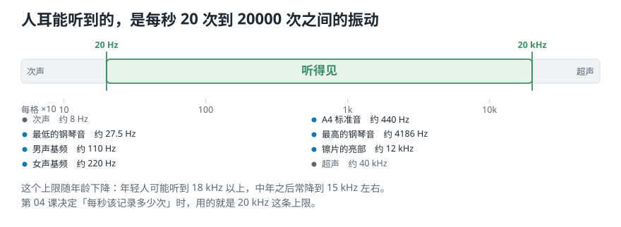

# 声音是怎么产生的，又怎么变成录音里那条线？

> **导读：** 上一课把任务定下来了：让程序分辨古典、爵士和摇滚。可程序拿到的是一长串数字，这串数字从哪儿来？这一课从最开头讲起——**一个物体振动，推动它周围的空气，这层推挤一圈圈传到麦克风，麦克风把每一瞬的推挤强弱记成一个数**。把这些数按时间画出来，就是录音软件里那条抖动的线，它叫波形。这条线里同时藏着三样东西：振动多快、振动多大、以及听起来是什么音色。这一课讲清前两样，音色留给第 03 课。

<picture>
  <source media="(max-width: 640px)" srcset="figures/mobile/00-course-position-02.svg">
  
</picture>

## 声音从一次振动开始

**声音是物体振动产生的。**

拨一下吉他弦，弦在原地来回抖。弦往一边走的时候，把它前面那层空气**挤紧**了；弦往回走的时候，那层空气又**变松**。于是弦周围的空气，就跟着弦一起一紧一松地来回动。

空气被挤紧的地方，压力比平时高一点；被拉松的地方，压力比平时低一点。**这一高一低的压力变化，就是声音。**

这里有三步，缺一不可：

1. **有东西在振动**——吉他弦、鼓面、你的声带、音箱的纸盆。
2. **振动推动了旁边的空气分子**，让它们跟着来回摆。
3. **空气的压力于是忽高忽低**，一圈圈往外扩散。

没有第三步就没有声音。真空里放一个正在响的闹钟，你听不见——不是闹钟没振动，是它周围没有空气可推。

<picture>
  <source media="(max-width: 640px)" srcset="figures/mobile/02-air-to-numbers.svg">
  
</picture>

*图 1：注意第二格里的小点——左边密、右边疏。空气本身没有跟着往右跑，只是在原地来回动，把「挤」这件事传给下一团。*

## 传出去的是能量，不是空气

上面那张图最容易误会的地方在这儿：**往外传的不是空气，是能量。**

工程上把这种现象叫**机械波**，它有三条性质：

- **它是一种在空间里传播的振动。** 一个位置先动，带动下一个位置动，一个接一个传下去。
- **传走的是能量，不是物质。** 每一团空气都只在自己那一小块地方来回摆，摆完还在原地。
- **传播过程中介质会发生形变。** 空气一会儿被挤密、一会儿被拉疏，这个「变形」正是波往前走的方式。

想象一下体育场里的人浪。一圈人依次站起来又坐下，看上去有一道浪从左边扫到右边——**可没有任何一个人跑到右边去**，每个人都只在自己的座位上起立、坐下。声音在空气里传播是同一回事：**动的是「起立坐下」这个动作，不是人本身。**

类比到此为止。回到声音：所以「声音传到你耳朵」的意思，不是吉他前面那团空气跑到了你耳边，而是那一紧一松的压力变化，一团接一团地传到了你耳边的那团空气上。

## 波形：把压力变化画成一条线

麦克风放在某个位置上，它做的事只有一件：**每隔极短的一瞬，量一次自己面前的空气被推挤得有多厉害，记下一个数。**

把这些数按时间先后画出来，横轴是时间，纵轴是那一瞬的压力偏离了平时多少，就得到一条上下抖动的曲线。**这条曲线叫波形。**

有两个限定词要记住，后面都会用上：

- 波形不是「声音」本身，是**一份记录**；
- 记的也不是「整个房间里的声音」，是**麦克风所在那一个点上**的压力变化。换个位置重录，同一个声源录出来的数字就不一样。

<picture>
  <source media="(max-width: 640px)" srcset="figures/mobile/02-waveform-carries.svg">
  
</picture>

*图 2：同一条波形里同时装着三样东西。这一课讲前两样；第三样叫**音色**——高低和响度都调成一样时，小提琴和钢琴听起来仍然不同，剩下的那点差别就是它，第 03 课专门讲。*

**一条波形同时带着三样信息：**

- **频率**——这条曲线一秒重复多少次。它对应你听到的高低。
- **强弱**——这条曲线上下抖多大。它对应你听到的**响度**，也就是这个声音在你耳朵里「有多响」。
- **音色**——高低和响度都一样时，小提琴和钢琴听起来仍然不同，剩下的那点差别就是音色。

前两样这一课就讲完。音色牵扯到成分比例和随时间的变化，是第 03 课的内容。

## 重复的声音，和不重复的声音

真实的波形分两大类，看它**有没有一段图案在一遍遍重复**：

- **周期性声音**：一段图案反复出现。持续拉响的琴弦、匀速转动的电机、唱出来的元音。
- **非周期性声音**：怎么看都找不到重复。风声、摩擦声、电流底噪，还有敲一下桌子这种一闪而过的声音。

<picture>
  <source media="(max-width: 640px)" srcset="figures/mobile/02-periodic-or-not.svg">
  
</picture>

*图 3：两条曲线都来自课程自带的真实录音。上面是小提琴，同一段图案一遍遍出现；下面是**噪声**——像收音机没调准时那种沙沙声，怎么截都找不到重复。*

不要只看曲线，先把图里的两段声音听一遍：

1. [小提琴：能听出稳定的高低](../../source_course/audio_resources/violin_c.wav)
2. [噪声：只有连续的沙沙声](../../source_course/audio_resources/noise.wav)

拖动播放器的进度时，也是在沿着横轴移动；你听到的每一个瞬间，都能在上面的波形里找到对应位置。

**这个区分很要紧，因为只有周期性声音才能问「这个音有多高」。** 音高说的就是「一秒重复几次」，不重复的东西根本数不出次数。对一段噪声调用音高算法，它照样会返回一个数字、也不报错，但那个数字不代表音高——它只是这段噪声里碰巧最强的那个成分。

## 一条重复的曲线，三个数就能说清

在所有会重复的波形里，最简单的一种是光滑、匀速上下的曲线，叫**正弦波**，听起来像那种很干净的电子提示音。

一条正弦波只要三个数就能完全确定。第一个是**频率**：这条曲线一秒重复多少次。它的单位叫**赫兹**，写作 Hz——440 Hz 就是一秒重复 440 次。重复一次所用的时间叫**周期**，它和频率互为倒数，440 Hz 的周期就是 1/440 秒。

第二个是**振幅**：这条曲线上下抖多大，也就是离中线最远能到多远。上一节说的「强弱」，量出来就是它。

第三个是**相位**：这条曲线从一轮里的哪个位置开始画。三个里它最容易被忽略，也只有它单独听不出来。

<picture>
  <source media="(max-width: 640px)" srcset="figures/mobile/02-sine-knobs.svg">
  
</picture>

*图 4：灰线是同一条基准曲线。左图蓝线更高，但一秒里的波数没变；中图波数翻倍，高度没变；右图形状和灰线完全一样，只是整条左右平移了。*

$$
x(t) = A\sin(2\pi f t + \varphi)
$$

式子里 $A$ 是振幅，$f$ 是频率，$\varphi$ 是初相位。乘 $2\pi$ 是把「转几圈」换算成「转过多少弧度」。

真实声音当然不止一条正弦。但**很多复杂声音都可以用一组高低、大小、起点各不相同的正弦波叠加出来**——这正是第 10 课以后整个傅里叶部分的基础。

**常见错误：以为相位可以随便扔。** 单独听一条持续的正弦，改相位确实听不出区别。但相位决定这条曲线和**别的**曲线怎样对齐——多条叠加时，相位不同，叠出来的结果就不同。[第 12 课](../第11-15课/12-复数形式的傅里叶变换-把强度和起点写进一个系数.md)会把这件事做成实验。

## 频率决定高低，振幅决定响度

这两个数各自对应一种听感，关系很直接：

- **频率越高，听起来越高。** 一秒振动 880 次的声音，听起来比一秒 440 次的高。
- **振幅越大，听起来越响。** 同一个音，抖得越大，听着越响。

两者互不干涉：你可以把一个音弹得很轻但很高，也可以弹得很响但很低。

不过「越大越响」只是大方向。**同样的振幅，放在不同的频率上，人听起来的响度并不一样**——这件事第 03 课专门讲。

## 人耳能听到多快的振动

不是所有频率人都听得见。**人耳大致能听到每秒振动 20 次到 20000 次之间的声音**，也就是 20 Hz 到 20 kHz。

<picture>
  <source media="(max-width: 640px)" srcset="figures/mobile/02-hearing-range.svg">
  
</picture>

*图 5：横轴按倍数分格。低于 20 Hz 叫次声，高于 20 kHz 叫超声，人都听不到；说话和音乐主要挤在中间那一段。*

- 低于 20 Hz 的叫**次声**，高于 20 kHz 的叫**超声**，人耳都听不见。
- 这个上限随年龄下降。年轻人可能听到 18 kHz 以上，中年之后常常降到 15 kHz 左右。

**这个范围后面要用到两次：** 第 04 课决定「每秒该记录多少次」时，上限 20 kHz 是关键依据；第 17 课把频率轴按听感重新分格时，也要用到人耳在这个范围内各处的分辨力并不均匀这件事。

## 耳朵按倍数分辨高低，不按差值

现在到了这一课最反直觉的地方。

先看三组数：

| 从 | 到 | 差多少赫兹 | 是多少倍 |
|---|---|---|---|
| 220 Hz | 440 Hz | 220 | 2 |
| 440 Hz | 880 Hz | 440 | 2 |
| 880 Hz | 1760 Hz | 880 | 2 |

赫兹的**差**从 220 一路涨到 880，翻了四倍。可这三组听起来是**完全相同**的距离——各一个八度。

**所以呢？** 所以「两个音差多远」这个问题，**不能用减法算，只能用除法算**。看到「这两个音差 100 Hz」就以为差得一样多，是错的：在低音区 100 Hz 可能是一个八度还多，在高音区可能连半音都不到。

这条性质叫**音高的对数感知**，一句话概括就是：**两个频率只要相差 2 的整数次幂倍，听起来就是同一个音名，只是高低不同。**

<picture>
  <source media="(max-width: 640px)" srcset="figures/mobile/02-note-vs-hz.svg">
  
</picture>

*图 6：四个圆点在横轴上是等距的（每隔 12 个键），纵轴上却是 220、440、880、1760——每一步都乘以 2，不是加上同一个数。*

这就是波形和听感之间的第一道错位：**波形只记下「一秒重复几次」这一个数，而耳朵分辨这个数的时候是按倍数比的。** 后面反复出现的对数频率轴和[梅尔刻度](../第16-20课/17-梅尔刻度-怎样按听感重新刻一把频率的尺子.md)，做的都是同一件事——把赫兹换成一把按倍数分格的尺子，让它对得上耳朵。

**常见错误：把频率轴画成等差刻度，然后说「低频看不清」。** 低频不是看不清，是你给这张图选错了刻度。人耳对频率的分辨力本来就按倍数分布，你却拿等差刻度去画，低音区当然全挤成一团。

## 实验：把音符编号换算成赫兹

既然耳朵按倍数听，音乐软件就不直接用赫兹，而是给每个琴键一个**编号**：编号每加 1 升高半音，加 12 升高一个八度。这套编号叫 **MIDI 音符号**。

换算公式是：

$$
f(m) = 440 \times 2^{(m-69)/12}
$$

```python
def midi_to_hz(m, a4=440.0):
    return a4 * 2 ** ((m - 69) / 12)
```

逐项看这行代码：**69** 是基准编号（A4 这个音），**440** 是它被约定成的赫兹数，**除以 12** 是因为一个八度分成 12 个半音，**2 的多少次方**就是「每 12 个半音翻一倍」。

运行 [`lesson02_pitch_and_hz.py`](../课程代码/lessons/lesson02_pitch_and_hz.py)，实测输出：

```text
编号 60  261.63 Hz
编号 72  523.25 Hz   倍数 2.0000
编号 69  440.00 Hz
编号 81  880.00 Hz   倍数 2.0000
编号 72  523.25 Hz
编号 84 1046.50 Hz   倍数 2.0000
编号 81  880.00 Hz
编号 93 1760.00 Hz   倍数 2.0000
```

四行的倍数都是 2.0000。**所以呢？** 所以「编号加 12」和「赫兹乘 2」是同一件事的两种写法——这正是把等距的琴键编号和按倍数走的赫兹接上的那座桥。往后看到「对数频率轴」，想的就是这张表。

反过来从赫兹找编号也一样，把公式倒过来解就行：

```text
   261.63 Hz -> 编号 60.000
   440.00 Hz -> 编号 69.000
   523.25 Hz -> 编号 72.000
```

用在真实录音上，结果不会这么整齐：

```text
violin_c  260.3 Hz -> 编号 59.9
          离最近的整数编号差 9 音分
piano_c   528.4 Hz -> 编号 72.2
          离最近的整数编号差 17 音分
```

编号不是整数，说明这个音没有正好落在标准音上。**差十几个音分是正常的演奏和估计误差；差到 100 以上就不是误差，是找错了八度。**

**两个必须记下来的参数：**

- **`a4=440` 是人为约定，不是物理常数。** 有些乐团用 A4 = 442 Hz，实测同一个编号会差 7.9 音分——而且每个编号都差这么多，因为它是整体乘了同一个比例。做音乐相关任务时，这个差别足以让两批标注对不上。
- **音高估计必须自己给搜索范围。** 实测把范围给成 30–200 Hz 时，一个真实音高在 260 Hz 附近的音被估成了 130.1 Hz——正好差一个八度。**函数照样返回一个数，不会报错**，它只是在你给的区间里找了个最像的。

## 比半音更细的差别：音分

半音以下的差距用**音分**表示。规定很简单：**一个八度分成 1200 音分，所以一个半音等于 100 音分。**

$$
c = 1200 \log_2 \frac{f_2}{f_1}
$$

实测：

```text
440 Hz -> 445 Hz    19.56 音分
220.0 -> 222.20 Hz  17.23 音分
440.0 -> 444.40 Hz  17.23 音分
880.0 -> 888.80 Hz  17.23 音分
（后三行都是「高 1%」）
```

三行都是 17.23。**所以呢？** 所以取对数的好处正在这里：**相同的频率比，永远换算出相同的音分数**，不管落在低音区还是高音区。这样一来，「跑调了多少」终于有了一把在全音域上都一样长的尺子。

**人能察觉的音高差大约在 10 到 25 音分之间**，也就是不到四分之一个半音。所以上面那个 19.56 音分，正好落在「仔细听能听出来」的边上。

## 这一课得到了什么，下一课接着讲什么

这一课从物体振动一路走到了那条曲线：**振动推挤空气 → 压力变化以机械波的形式传出去 → 麦克风逐点记录 → 得到波形。** 波形里同时带着频率、强弱和音色三样信息；我们讲清了前两样，还发现耳朵分辨高低时是按倍数比的，所以有了 MIDI 编号和音分这两把尺子。

剩下两样没讲：

- **强弱到底怎么量？** 「振幅越大越响」只是大方向，同样的振幅放在不同频率上，人听起来并不一样响。
- **音色是什么？** 高低和响度都对齐之后，小提琴和钢琴为什么还是一听就分得出来？

[下一课](03-强弱响度与音色-音量一样为什么听起来不同.md)专门讲这两件事：声音的强弱怎么一层层量出来，人耳的响度为什么和仪器读数对不上，以及音色由哪几样东西决定。
