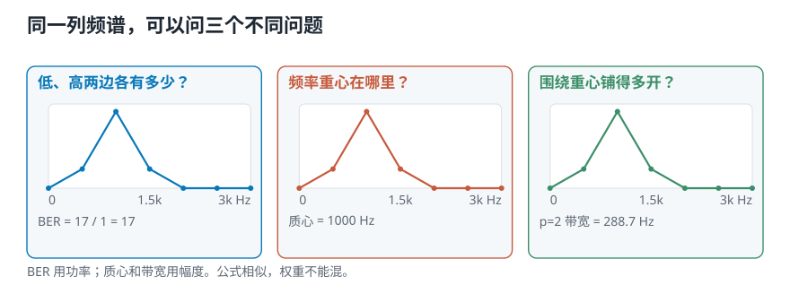
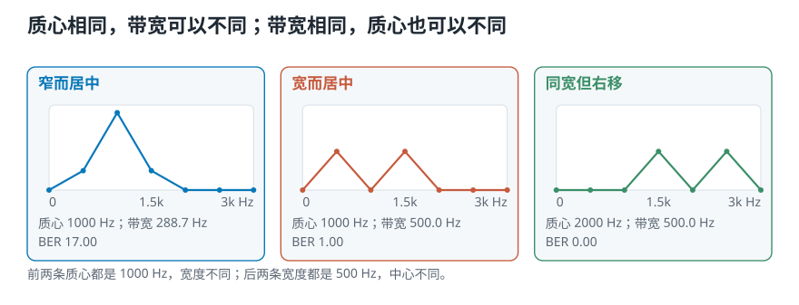

# 一列频谱怎样压成三个数：带能量比、频谱质心与带宽

> **导读：** 声谱图的一列有上千个频率格。它很完整，却不适合直接回答三个简单问题：低频相对高频有多少？频率的重心在哪里？频率围绕重心铺得多开？这一课给这三个问题各配一个数：**带能量比、频谱质心和频谱带宽**。我们还会造三列答案已知的频谱，证明这三个数观察的是不同侧面，谁也代替不了谁。

<picture>
  <source media="(max-width: 640px)" srcset="figures/mobile/00-course-position-21.svg">
  
</picture>

完整代码在[第 21 课脚本](../课程代码/lessons/lesson21_freq_features.py)，运行环境沿用[课程总纲](../课程总纲/README.md)里的一次性配置。

## 这一课要完成什么实验

我们先不碰真实音乐，而是造三列很小的频谱。**频率表示声音每秒振动多少次；频谱就是把一帧里各个频率有多强排在一条轴上。** 每一列只有 0、500、1000……3000 Hz 七个频率格，每个数都是自己放进去的，所以质心和带宽应该落在哪里，可以提前知道。

实验要做两组对照：

1. 让两列频谱的质心都在 1000 Hz，但把其中一列铺得更开；
2. 保持带宽都是 500 Hz，只把整列频谱向高频移动。

如果计算正确，第一组应该“质心相同、带宽不同”，第二组应该“带宽相同、质心不同”。这比直接拿真实音乐看三条曲线更严格：真实录音没有标准答案，算错了也可能看起来很像。

<picture>
  <source media="(max-width: 640px)" srcset="figures/mobile/21-spectrum-to-numbers.svg">
  
</picture>

## 从一列频谱开始

一段录音先切成短帧，每帧**加窗——也就是让帧的两端平滑收起**，再做**傅里叶变换——也就是检查这一帧含有哪些频率**，得到一列频谱。这条路在[第 15 课](../第11-15课/15-短时傅里叶变换-整段频谱为什么找不到声音发生的时间.md)已经走完了。

现在只约定几个符号：

- $t$ 表示第几帧；
- $n$ 表示第几个频率格；
- $m_t(n)$ 表示第 $t$ 帧、第 $n$ 格的[**幅度**](../第06-10课/10-傅里叶变换的直觉-拿已知频率去问声音里有没有它.md)；
- $f[n]$ 表示第 $n$ 格真正对应的频率，单位是 Hz；
- 一列一共有 $N$ 个频率格。

接下来三个特征，都是把这一列的 $N$ 个数压成**一个数**。录音有多少帧，就会得到多少个特征值；把它们沿时间排起来，才是一条特征轨迹。

## 带能量比：分界线两边谁更多

先定一条分界频率，例如 2000 Hz。低于它的频率格放到一边，不低于它的放到另一边，然后分别累计功率：

$$
\operatorname{BER}_t =
\frac{\sum_{n=0}^{F-1} m_t(n)^2}
{\sum_{n=F}^{N-1} m_t(n)^2}
$$

$F$ 是高频侧的第一格。这里把幅度平方，是因为 BER 比较的是**能量**。

- BER 大于 1：分界线下方的功率更多；
- BER 等于 1：两边一样多；
- BER 小于 1：上方更多。

它的名字叫**带能量比**，其中“频带”只是“一段频率范围”。

换个说法更好记：**这个数在回答“低音有多占优势”。** BER 越大，声音的劲越集中在低的那一头；越小，说明高频那一半拿走了更多能量。一段以低音提琴和底鼓为主的录音，BER 会明显大于一段以镲片和齿音为主的录音。

分界线不是自然界规定的答案，而是任务参数：分鼓点和持续声，可能关心较低的分界；分析语音，可能选另一段频率。

## 频谱质心：频率的重心在哪里

把每个频率格想成跷跷板上的一个位置。幅度越大，那一格把重心拉向自己的力就越大：

$$
C_t =
\frac{\sum_{n=0}^{N-1} f[n]m_t(n)}
{\sum_{n=0}^{N-1} m_t(n)}
$$

这就是**加权平均**。普通平均里每个数说话一样大；这里幅度大的频率格说话更大声。

不看公式也有一句能记住的说法：**质心指向这一帧里能量最集中的那段频率。** 幅度都堆在低频，跷跷板的支点就往低处挪；高频起来了，支点跟着往上走。

公式里必须写真实频率 $f[n]$，不能只写格号 $n$。只用 $n$ 算出的结果是“第几格”，换了采样率或 FFT 长度就会变；用 $f[n]$，结果才是可以解释的 Hz。

频谱质心常被当作声音“明亮程度”的线索：高频成分增加时，质心通常会上移。但它**不是音高**。一堆高频噪声也能把质心拉高，却不会让人听见一个更高的音符。

## 频谱带宽：离重心有多远

质心只给中心，不告诉我们频率挤在中心附近，还是散到两边。于是再量每一格离质心的距离：

$$
B_t^{(p)} =
\left(
\frac{\sum_{n=0}^{N-1}|f[n]-C_t|^p m_t(n)}
{\sum_{n=0}^{N-1}m_t(n)}
\right)^{1/p}
$$

这里的 $p$ 决定“远处的频率格要受多大重视”：

- $p=1$：平均绝对距离；
- $p=2$：先平方、求平均、再开方，也就是均方根距离。

两种定义都合理，但算出的数字不同，不能只写“带宽 500 Hz”却不说 $p$。第 23 课会用 $p=2$，因为那是库函数的默认值。

$p=2$ 那一支还有个更眼熟的名字：**把它展开就是频率分布的加权标准差**——以幅度为权重，量各个频率离质心的典型偏离。见过标准差的读者可以直接套过来用：标准差小，说明数据挤在平均值附近；带宽小，说明能量挤在质心附近。

这个数还接上了一件很早以前的事。[第 03 课](../第01-05课/03-强弱响度与音色-音量一样为什么听起来不同.md)问过“音量一样，为什么钢琴和小提琴听起来不同”，当时的答案是“泛音的分布不一样”，但没有给出可计算的量。**带宽正是把那句话变成一个数的办法之一**：泛音铺得开，带宽就大。它当然不等于音色——音色还牵涉泛音的相对强弱和随时间的变化——但它是这门课里第一个能把“铺得开不开”量出来的数。

<picture>
  <source media="(max-width: 640px)" srcset="figures/mobile/21-three-questions-new.svg">
  
</picture>

## 三个公式放进同一组已知答案

实验把分界频率放在 1200 Hz，并约定低侧是 `< 1200 Hz`，高侧是 `>= 1200 Hz`。三列频谱的计算结果是：

| 频谱 | 低侧功率 | 高侧功率 | BER | 质心 | $p=1$ 带宽 | $p=2$ 带宽 |
|---|---:|---:|---:|---:|---:|---:|
| 窄而居中 | 17 | 1 | 17.00 | 1000 Hz | 166.7 Hz | 288.7 Hz |
| 宽而居中 | 4 | 4 | 1.00 | 1000 Hz | 500.0 Hz | 500.0 Hz |
| 同宽但右移 | 0 | 8 | 0.00 | 2000 Hz | 500.0 Hz | 500.0 Hz |

第一行的 BER 可以直接核对。低侧三个幅度是 0、1、4，功率和为 $0^2+1^2+4^2=17$；高侧只有一个幅度为 1，功率和为 1，所以 BER 是 17。

更重要的是两组对照：

- “窄而居中”和“宽而居中”的质心都是 **1000 Hz**，但 $p=2$ 带宽是 **288.7 Hz** 和 **500.0 Hz**；
- “宽而居中”和“同宽但右移”的带宽都是 **500.0 Hz**，质心却是 **1000 Hz** 和 **2000 Hz**。

<picture>
  <source media="(max-width: 640px)" srcset="figures/mobile/21-independent-features-new.svg">
  
</picture>

所以三个数不能互相替代：BER 看分界线两边，质心看中心，带宽看展开。它们也都看不见完整的频谱形状——两列不同的频谱完全可能得到相同的三个数。**特征是摘要，不是原件。**

## 这三个数拿来做什么

把一列频谱压成三个数，不是为了省地方，而是为了让程序能拿它们做判断。这三个特征在实际任务里各有常见去处：

- **带能量比**最常用在两件事上：**把音乐和语音分开**，以及**判断一段音乐属于哪种风格**。语音的能量集中在一段相对窄的低中频里，配器完整的音乐通常在高频那一半留下更多东西，两者的 BER 分布因此不一样。
- **频谱质心**用于音频分类和音乐分类。它给出的“亮不亮”，是很多分类任务里最省事又最有用的一个数。
- **频谱带宽**同样用于**音乐风格分类**，它补的是质心答不了的那一半：两段录音的亮度可以接近，但一段的能量收得很紧、另一段铺得很开。

这三条正好落在你手上那个项目里。[课程项目](../课程项目/README.md)要让程序听 1 秒钟的片段，判断它是古典、爵士还是摇滚——**这就是上面反复出现的“音乐风格分类”。** 到第 23 课，我们会把这三个数真的算到那三段音乐上，然后回答一个更具体的问题：**哪一个数分得开哪一对风格？** 答案不是“三个都有用”那么省事。

## 这一课得到了什么，下一课接着讲什么

这一课把一列频谱压成了三个回答不同问题的数：

1. **带能量比**用功率，比较分界频率两边；
2. [**频谱质心**](23-频谱质心与带宽-怎样量出中心和展开.md)用幅度，求真实 Hz 频率的加权平均；
3. [**频谱带宽**](23-频谱质心与带宽-怎样量出中心和展开.md)用幅度，量频率围绕质心铺得多开，而且必须说明 $p$ 的取值。

受控实验还给了两个不能混过去的结果：质心同为 **1000 Hz** 时，带宽可以是 **288.7 Hz** 或 **500.0 Hz**；带宽同为 **500.0 Hz** 时，质心也可以从 **1000 Hz** 移到 **2000 Hz**。

[下一课](22-用Python实现带能量比-2000Hz到底该切在哪一格.md)先实现 BER。真正容易写错的不是除法，而是**2000 Hz 究竟落在第几格，以及矩阵的哪一维才是频率**。
