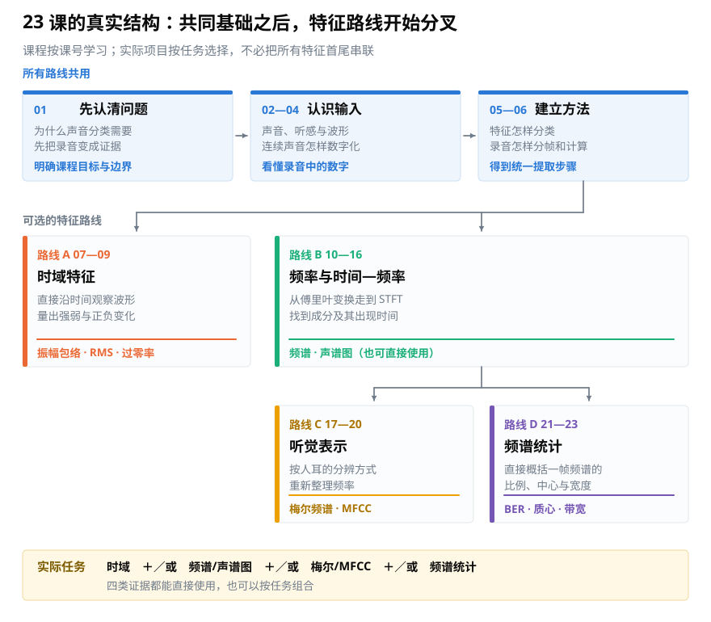

# 课程总纲：23 讲按什么顺序学习

> **导读：** 这页只回答三件事：课程学到哪里为止、开始前要装什么、23 讲为什么按这个顺序排列。完整路线只在这里保留一份；各课正文负责解释当课的问题和实验，不再复制整张路线图。

<picture>
  <source media="(max-width: 640px)" srcset="figures/mobile/course-roadmap.svg">
  
</picture>

*图：三个蓝色框是共同基础。橙色和绿色是两种直接路线；把声音拆成不同高低成分之后，还可以继续按听感重新排列，或者压成少量概括数字。几类结果可以按任务单独使用，也可以组合。*

## 课程边界

电脑收到的录音是一串随时间排列的数字。要让后续程序分辨说话、音乐、环境声或设备状态，第一步是把这些数字整理成能够比较、能够解释的证据。这 23 讲就停在这一步：

- 从声音怎样产生讲到数字录音；
- 把录音切成短片段，分别沿时间观察，或拆出其中不同高低的成分；
- 检查单位、坐标、表格行列方向和参数是否可信；
- 把结果整理成可以交给分类程序的输入。

所谓**模型**，就是从许多带答案的例子里学出判断规则的程序。模型怎样训练、怎样调参、怎样上线，不在本课程范围内。这样划线，是为了让每一课都能围绕音频信号处理本身完成一个可检查的结果。

正文反复出现的“古典、爵士、摇滚三选一”只是 23 讲共用的一道验收题，用来检查某个特征是否真的有区分力；它不是第二套课程，也不是与上图并列的另一条路线。项目的目录、文件规格和最终产物保留在仓库的[课程项目说明](../课程项目/README.md)中，网站首页不再给它单独设入口。

## 开始前需要什么环境

**装一次，23 讲全程不用再动。** 需要 Python 3.10 或更新版本，五个包一行装完：

```bash
python -m pip install numpy scipy matplotlib librosa soundfile
```

五个包各管一件事：`numpy` 负责数组计算，`scipy` 提供信号处理函数，`matplotlib` 画图，`librosa` 读取音频并提供音频专用函数，`soundfile` 是实际读写声音文件的底层工具。**这门课不需要 API Key，也不需要 `.env` 文件**，所有计算都在本机完成。

网站随仓库发布七段教学示例音频：音阶、噪声、钢琴、小提琴、萨克斯、颤音和人声。三段商业音乐只提供外部试听入口，不打包进公开站点；运行三分类项目时，需要读者自行准备有权使用的片段。

全课程的数值在下面这组版本上实测。你的版本不同，最后一两位小数可能略有差别，结论不变：

| 包 | 版本 |
|---|---|
| Python | 3.12.10 |
| numpy | 2.5.2 |
| scipy | 1.18.1 |
| matplotlib | 3.11.1 |
| librosa | 1.0.0 |
| soundfile | 0.14.0 |

## 23 讲的完整路线

### 第 01 讲：先认清问题

先弄清声音分类为什么不能直接照搬图片分类，并明确课程终点是准备可信的声音特征，不包括模型训练和部署。

### 第 02—04 讲：认识声音与数字录音

学习声音怎样产生、波形记录什么、仪器读数和人的听感有什么差别，以及连续声音怎样经过采样和量化变成数字。

### 第 05—06 讲：建立特征地图和提取步骤

先分清不同类型的声音特征各自保留什么，再建立载入、分帧、计算和汇总的统一步骤。到这里为止，后面各条路线共用的准备工作已经完成。

### 第 07—09 讲：时域特征路线

不拆解频率，直接沿时间观察每个短片段，计算振幅包络、RMS 和过零率。这条路线适合回答“什么时候更强”“变化有多剧烈”等问题。

### 第 10—16 讲：频率与时间—频率基础

从傅里叶变换的直觉开始，经过复数、DFT、FFT 和 STFT，最终得到频谱与声谱图。这一段是后面两条频率路线共同使用的基础。

### 第 17—20 讲：听觉表示路线

把声谱图重新汇总到更接近人耳分辨方式的频率尺度，并进一步得到梅尔频谱和 MFCC。

### 第 21—23 讲：频谱统计路线

直接从频谱中计算带能量比、频谱质心和频谱带宽，回答低处与高处哪边更强、分布中心在哪里、成分铺得有多开。它与梅尔频谱、MFCC 是按任务选择或组合的不同路线，不是它们之后的固定步骤。

## 每一讲怎样使用

每遇到一个新概念，正文都会按同一组动作推进：先说它要解决什么问题，再用图确认输入和输出，然后用短代码计算真实结果，最后改变一个参数或输入观察结果怎样变化。完整脚本统一放在[课程代码目录](../课程代码/README.md)，正文只保留看懂实验所需的代码。

学习时不必预先背公式。先看图、听声音、拖动交互控件，再回到公式逐项对应，通常更容易建立直觉。

## 学完后能够做什么

- 看懂波形、频谱、声谱图和梅尔频谱各自表达什么。
- 用 Python 把录音切成短段，提取常见的时域与频域特征。
- 判断数字表中哪一边表示时间、哪一边表示频率，并建立正确坐标。
- 发现采样率、分析窗口、边缘处理、数值单位和除零造成的错误。
- 从任务真正需要的声音证据出发，选择更合适的程序输入。

这套课程最终要建立的习惯是：不要把库函数的输出直接当成答案，而要能说明它从哪里来、代表什么、在什么条件下值得相信。

下一步：读[第 01 讲](../第01-05课/01-课程导论-电脑要怎么分辨音乐类型.md)。
